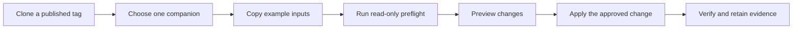

# AI Data Platform CVD deployment companions

This directory contains the customer-facing deployment companions for the
AI Data Platform CVD implemented with Cisco compute and networking, VAST Data,
NVIDIA AI, and Red Hat OpenShift. Use one published repository tag as the
versioned unit for documentation, configuration examples, scripts, and
validation evidence.



## Companion map

| Area | Start here | Purpose |
|---|---|---|
| Architecture and workflows | [`docs/README.md`](docs/README.md) | Understand the shared platform and the three validated workload data paths. |
| Cisco Nexus | [`nexus/README.md`](nexus/README.md) | Render and validate the reference fabric configuration. |
| VAST DataEngine | [`dataengine/README.md`](dataengine/README.md) | Deploy Zot, initialize Zarf, enable DataEngine, and verify the service. |
| VAST InsightEngine | [`insightengine/README.md`](insightengine/README.md) | Prepare the VAST mapping, deploy InsightEngine, and verify its runtime. |
| Document RAG | [`workloads/document-rag/README.md`](workloads/document-rag/README.md) | Validate local models and the complete governed Document RAG flow. |
| VAST-native VSS | [`workloads/vast-native-vss/README.md`](workloads/vast-native-vss/README.md) | Build, deploy, validate, and roll back the VAST-native video workflow. |
| NVIDIA VSS 3.2.1 Search | [`workloads/nvidia-vss-3.2.1-search/README.md`](workloads/nvidia-vss-3.2.1-search/README.md) | Deploy and validate the NVIDIA Search profile on OpenShift. |

## Standard walkthrough

1. Read the selected companion README and confirm its prerequisites.
2. Copy `release-inputs.example.env` to `release-inputs.env` where provided.
3. Replace every `REQUIRED` value. Do not put credentials, tokens, kubeconfigs,
   private keys, certificates, or Kubernetes Secret values in Git.
4. Run the companion preflight. It verifies the exact OpenShift API and context
   before any change.
5. Render or preview the intended change and review the generated resources.
6. Run the apply command only after approval.
7. Run the verifier or acceptance suite and retain the sanitized result in the
   site's approved evidence location outside the repository.
8. Use the companion rollback procedure when a known-good revision must be
   restored. Application rollback does not imply data deletion.

Site-completed input files, rendered manifests, credentials, kubeconfigs,
private key material, and transient build output remain outside the published
repository.

## Repository boundary

This repository contains deployment companions rather than the complete CVD
publication or vendor software distributions. Obtain the VAST and NVIDIA
release artifacts identified by each companion from their authoritative
sources. Use only the versions pinned by the selected repository tag.

Original content in this repository is provided under the
[MIT License](LICENSE). Third-party materials remain subject to their upstream
terms, and product names and trademarks remain the property of their
respective owners.

Review [THIRD_PARTY_NOTICES.md](THIRD_PARTY_NOTICES.md) before distributing the
repository, and use [SECURITY.md](SECURITY.md) for security-reporting guidance.

## Validate the repository

Run the dependency-free repository check before every review or release:

```bash
python3 scripts/validate-repository.py
```

The check rejects internal authoring markers and high-confidence credential
patterns, verifies local Markdown links, parses Python and JSON files, and
confirms the recorded VAST-native VSS dependency and patch hashes. GitHub
Actions also checks all shell and YAML syntax.
