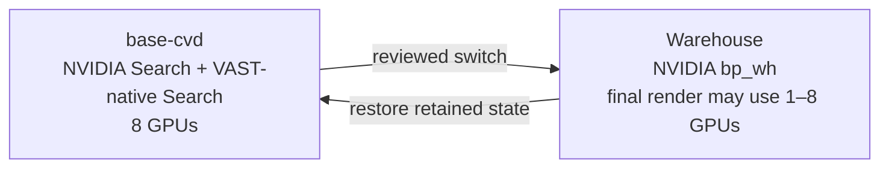

# Warehouse Operations Demonstration

Status: **implementation starter; not yet deployable**. The Warehouse profile
has not been deployed to OpenShift. Use the material here to complete and
validate a site-specific port before enabling execution.

This directory prepares an OpenShift adaptation of the NVIDIA VSS 3.2.1
Warehouse `bp_wh` profile while preserving the two validated CVD video-search
lanes as one recoverable `base-cvd` mode.



The `1–8` range is the permitted capacity policy, not a claim that every count
is represented by the current provisional topology. The accepted Helm render
will lock one exact count within that range. The switch changes only
source-locked GPU controller replicas and opens a
short scheduling window on the configured GPU node. Helm releases, CPU services, PVCs,
model caches, NVIDIA indices and videos, VAST S3 objects, and VASTDB rows remain
in place. Warehouse execution is blocked until its final rendered GPU
controller inventory is complete and approved.

## Directory map

| Path | Purpose |
|---|---|
| [`IMPLEMENTER-CHECKLIST.md`](IMPLEMENTER-CHECKLIST.md) | Ordered prerequisites, implementation stages, blockers, exit criteria, and handoff record for completing the OpenShift adaptation |
| [`profiles.example.yaml`](profiles.example.yaml) | Site-neutral template for the cluster lock, exact base controllers, Warehouse placeholders, and safety policy; copy it to the ignored local file `profiles.yaml` before use |
| [`scripts/show-status.sh`](scripts/show-status.sh) | Read-only profile, release, node, controller, pod, and GPU status |
| [`scripts/set-demo-mode.sh`](scripts/set-demo-mode.sh) | Plan-first reversible GPU mode switch; execution remains blocked for unresolved Warehouse controllers |
| [`runbooks/PROFILE-SWITCHING.md`](runbooks/PROFILE-SWITCHING.md) | Operator procedure and restore acceptance for both CVD search lanes |
| [`openshift/nvidia-warehouse/chart/`](openshift/nvidia-warehouse/chart/) | Inert-by-default OpenShift Helm skeleton |
| [`openshift/nvidia-warehouse/source-lock.yaml`](openshift/nvidia-warehouse/source-lock.yaml) | Pinned NVIDIA source, images, models, services, and provisional GPU map |
| [`research/NVIDIA-SOURCE-INVENTORY.md`](research/NVIDIA-SOURCE-INVENTORY.md) | Source-derived Warehouse component inventory |
| [`research/WAREHOUSE-CONFIG-INVENTORY.md`](research/WAREHOUSE-CONFIG-INVENTORY.md) | Runtime, initialization, configuration, storage, service-DNS, and digest evidence |
| [`research/NGC-IMAGE-RESOLUTION.md`](research/NGC-IMAGE-RESOLUTION.md) | Credential-safe verification and immutable-digest evidence for the four protected NVIDIA images |
| [`research/OPENSHIFT-PORTING-MATRIX.md`](research/OPENSHIFT-PORTING-MATRIX.md) | Compose-to-OpenShift decisions and unresolved gaps |
| [`data/warehouse-data-manifest.yaml`](data/warehouse-data-manifest.yaml) | Dataset, camera, hash, and evidence fields |
| [`data/ALERT-SCENARIO-MATRIX.md`](data/ALERT-SCENARIO-MATRIX.md) | Stock alert types, required evidence, and claim boundaries |
| [`runbooks/ALERT-SCORING.md`](runbooks/ALERT-SCORING.md) | Two-reviewer evidence and three-run qualification procedure |
| [`scripts/resolve-image-digests.py`](scripts/resolve-image-digests.py) | Read-only image tag-to-digest resolver; never prints registry credentials |
| [`scripts/resolve-protected-ngc-images.sh`](scripts/resolve-protected-ngc-images.sh) | Hidden-prompt temporary NGC login and four-image digest check |
| [`validation/HELM-RENDER-CHECK.md`](validation/HELM-RENDER-CHECK.md) | Helm lint, inert render, standby-GPU render, and fail-closed digest evidence |

The full design and milestone plan is in
[`../../plans/warehouse-operations-control-tower/IMPLEMENTATION-PLAN.md`](../../plans/warehouse-operations-control-tower/IMPLEMENTATION-PLAN.md).

## Safe local checks

These commands do not change OpenShift:

```bash
bash -n \
  demos/warehouse-operations/scripts/show-status.sh \
  demos/warehouse-operations/scripts/set-demo-mode.sh \
  demos/warehouse-operations/scripts/resolve-protected-ngc-images.sh

PYTHONDONTWRITEBYTECODE=1 python3 -B -m unittest discover \
  -s demos/warehouse-operations/tests \
  -p 'test_*.py' -v
```

From the repository root on the OpenShift administration client, create the
local profile file, replace every placeholder with verified site values, and
then run the read-only or plan-only commands:

```bash
cp demos/warehouse-operations/profiles.example.yaml \
  demos/warehouse-operations/profiles.yaml
# Edit profiles.yaml with the verified cluster, node, release, and controller values.

demos/warehouse-operations/scripts/show-status.sh
demos/warehouse-operations/scripts/set-demo-mode.sh warehouse
demos/warehouse-operations/scripts/set-demo-mode.sh base-cvd
```

Do not add `--execute` until the Warehouse chart, immutable digests, GPU map,
server-side dry-run, exact commands, effects, and rollback have been reviewed
and explicitly approved.

The switch and recovery framework has offline failure-injection coverage, but
demo-level restoration is not accepted until three complete switch cycles and
the functional tests for both base VSS lanes pass.
