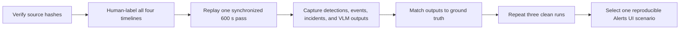

# Warehouse Alert Scenario Matrix

Status: source metadata and stock rules verified; footage scoring and positive
alert timestamps pending

Date: 2026-09-21

No alert in the four-camera sample is currently qualified for a demonstration.
The files and configurations are verified, but no source timestamp has yet been
human-labeled and reproduced through the NVIDIA Warehouse Alerts UI. An empty
`verified_positive_alerts` list in
[`warehouse-data-manifest.yaml`](warehouse-data-manifest.yaml) is intentional.

## Four-camera identity map

All four originals are MP4/H.264, 1920x1080, 30 FPS, and 600 seconds according
to the retained acquisition record. SHA-256 values below were recomputed
read-only on the retained files on 2026-09-21. The media is not committed.

| Source file | Bytes | NVIDIA sensor | VAST camera ID | VAST staging prefix | Alert status |
|---|---:|---|---|---|---|
| `Camera.mp4` | 132,127,169 | `Camera` | `WAREHOUSE-CAM-00` | `warehouse-01-cam-00/` | Unscored |
| `Camera_01.mp4` | 171,947,958 | `Camera_01` | `WAREHOUSE-CAM-01` | `warehouse-01-cam-01/` | Unscored |
| `Camera_02.mp4` | 223,883,428 | `Camera_02` | `WAREHOUSE-CAM-02` | `warehouse-01-cam-02/` | Unscored |
| `Camera_03.mp4` | 162,912,541 | `Camera_03` | `WAREHOUSE-CAM-03` | `warehouse-01-cam-03/` | Unscored |

The pinned calibration defines `roi-id-1` and `tripwire-id-1` for each NVIDIA
sensor. The VAST lane has separately accepted the existing 0-90 second
excerpts as four cameras and 72 five-second segments. That proves identity,
ingestion, retrieval, and playback; it does **not** prove an NVIDIA alert.

## What the stock profile can generate

The rule layers must not be conflated:

| Layer | Stock v3.2.1 configuration | Output | Alerts UI meaning |
|---|---|---|---|
| Perception | RT-DETR labels include `Person`, `Forklift`, and `Pallet` | Tracked objects on `mdx-raw` | Input evidence only |
| ROI/tripwire | One ROI and one tripwire per sensor; `tripwireMinPoints=4` | ROI/tripwire records on `mdx-events` | Behavior event, not automatically a verified alert |
| Behavior incidents | Proximity, restricted-area, and confined-area incident generation enabled; each has a two-second incident threshold | Candidate incidents on `mdx-incidents` | Only a configured verifier/bridge path produces a verified Alerts UI record |
| Near miss | Forklift is the center class, Person the surrounding class, proximity threshold 4 m; `proximity violation` is the sole stock verification category | Cosmos3 verdict and output category `Near Miss Violation` | `confirmed`, `rejected`, or `unverified` record |
| Real-time VLM | Four always-on rules below run directly on video chunks | VLM-classified alert output through the Alert Bridge | Alert row when the rule returns its violation class and delivery succeeds |

The four stock always-on rules use Cosmos3 Nano Reasoner, zero chunk overlap,
one sampled frame per second, 854x480 VLM input, reasoning enabled, 4096
maximum tokens, and temperature 0.0.

| Rule ID | UI alert type | Chunk | Positive definition in pinned prompt |
|---|---|---:|---|
| `ppe` | PPE Violation | 6 s | At least one clearly visible worker lacks a rigid hard hat or high-visibility outer garment |
| `load_quality` | Load Quality Violation | 7 s | A load is concretely damaged, falling/fallen from a traceable source, spilling, or visibly unstable |
| `pathway_obstruction` | Pathway Obstruction Violation | 8 s | A concrete unexpected object or material is on an active aisle, walkway, or travel lane |
| `spillover` | Spillover Violation | 5 s | Spilled contents are visible on the floor with a plausible source container |

Worker-fall detection is **not** a stock rule. In particular, the load-quality
prompt explicitly excludes person falls. A worker-fall demo requires a new
rule, suitable positive and negative footage, and separate accuracy testing.

## Candidate scenario matrix

The acquisition record establishes only that the dataset collectively shows
fixed warehouse views with workers, forklifts, boxes, pallets, and movement.
It does not establish which camera or timestamp contains a violation.

| Scenario | Why it is worth testing | Current positive status | Demo gate |
|---|---|---|---|
| Near miss | Workers and forklifts make an upstream proximity candidate plausible | Unknown on all four cameras | Same human-confirmed interaction produces a proximity incident, playable evidence, and `confirmed` verdict in 3/3 runs |
| PPE violation | Workers are present in the dataset | Attire unscored on all four cameras | A clearly visible missing hard hat or high-vis garment produces the same alert in 3/3 runs |
| Load quality | Boxes and pallets are present | Damage, fall, spill, or instability unscored | Concrete load defect is visible and alert repeats in 3/3 runs |
| Pathway obstruction | Warehouse travel areas are visible | Floor obstruction unscored | A named object is visibly on the active path and alert repeats in 3/3 runs |
| Spillover | Stock rule is available | No visible spill has been established | Source and spilled material are both visible and alert repeats in 3/3 runs |
| ROI/tripwire | Geometry exists for every camera | Crossings unscored | Expected `mdx-events` record repeats; count as analytics evidence, not the headline Alerts UI incident |
| Restricted/confined area | Incident generation is enabled | Polygon occupancy unscored | Candidate incident repeats and any claimed Alerts UI path is separately demonstrated |
| Worker fall | Not implemented by stock profile | Unsupported | Excluded from the first demo |

Do not describe any row as a positive alert until it has a source timestamp,
human ground-truth label, system identifiers, playable evidence, and a repeated
result. A rejected near-miss verdict can validate plumbing but is not a
positive safety-alert demonstration.

## Evidence to retain for every scored run

| Evidence group | Required fields |
|---|---|
| Run identity | Demo run ID, UTC start/end, source commit, dataset/archive hash, four source hashes, configuration hashes, image digests, exact model IDs, and replay iteration |
| Camera identity | Source filename, NVIDIA sensor ID, VAST camera ID, source-relative start/end, and stream registration status |
| Human label | Rule, positive/negative/uncertain, start/end seconds, concise visible facts, reviewer IDs, and adjudication result |
| Perception | Sensor, timestamp, detected class, track ID, confidence when supplied, and source Kafka topic/partition/offset |
| Behavior | Behavior/event/incident ID, category, object IDs/classes, sensor, start/end, ROI or tripwire ID when applicable, and topic/partition/offset |
| VLM | Rule/category, input incident ID for verification, clip interval, model ID, configuration hash, class ID/label/answer or verdict, and latency |
| Delivery | Alert Bridge ID, Elasticsearch document/index, Alerts UI row and filters, verification status, verdict, thumbnail/video availability, and one timestamped screenshot |
| Agent report | Alert ID passed to Generate Report, tools/evidence identifiers used, final report, and a check that each factual claim is grounded in retained event or video evidence |
| Health | Relevant pod readiness/restarts, unresolved Warning events, GPU assignment, and failures/timeouts; never retain credentials or unredacted sensitive logs |

Keep identifiers and sanitized JSON/text evidence in the run directory. Do not
commit NVIDIA source video, derived clips, credentials, tokens, Secret values,
private URLs, vectors, or complete sensitive logs.

## Repeatable scoring procedure

1. **Freeze inputs.** Verify every SHA-256 in the manifest and the five pinned
   configuration hashes. Record exact image digests and model IDs. Stop on any
   mismatch.
2. **Create ground truth.** Two reviewers independently watch all four complete
   600-second sources once and label every candidate for the five stock alert
   types. Labels are `positive`, `negative`, or `uncertain`; each label includes
   sensor, start/end seconds, and only visible facts. Reviewers adjudicate every
   disagreement before system output is examined.
3. **Select controls.** For each rule, retain every adjudicated positive and at
   least three clear negative windows across at least two cameras. If no
   positive exists, record `no demonstrated positive`; do not manufacture one
   by prompt or threshold changes during the baseline run.
4. **Run one bounded pass.** Start all cameras at source second 0, use the
   pinned calibration and stock rules, and score only the first 600 seconds.
   Ignore subsequent NVStreamer loops. Use synchronized UTC and source-relative
   timestamps.
5. **Capture the chain.** Preserve object detections, `mdx-events`,
   `mdx-incidents`, verifier or always-on VLM output, Alert Bridge delivery,
   Elasticsearch record, Alerts UI row, and playable VIOS evidence. Missing
   lineage at any stage is a failed chain, even if a UI row happens to appear.
6. **Match one-to-one.** A prediction matches ground truth only when the sensor
   and rule match and the predicted interval overlaps the adjudicated interval
   by at least one second. For near miss, the candidate incident ID must also be
   traceable through verification. Match each label and prediction once; count
   extra overlapping alerts as duplicates.
7. **Score.** A true positive is a matched positive with `confirmed` near-miss
   verdict or violation class `0/Yes` for an always-on rule. A false positive is
   an unmatched positive prediction; a false negative is an unmatched positive
   label. Report TP, FP, FN, precision, recall, duplicate count, rejected,
   unverified/failed, and end-to-end latency per rule and camera. Report
   behavior candidate generation separately from VLM verification.
8. **Repeat cleanly three times.** Reset replay position and run-specific state
   without deleting retained platform data. A demo candidate passes only if the
   same ground-truth event completes the full chain in 3/3 runs, the correct
   clip plays, the verdict/class is stable, and Generate Report remains
   grounded. Otherwise keep the scenario marked non-repeatable.

The first external demo needs one supported scenario that passes this gate; it
does not need every stock rule to have a positive example. Prefer Near Miss if
it passes. Otherwise use the clearest repeatable PPE, load-quality, obstruction,
or spillover event and state its exact rule.

## Source locks

- [NVIDIA VSS v3.2.1 source at the pinned commit](https://github.com/NVIDIA-AI-Blueprints/video-search-and-summarization/tree/7640d917047cf7b0fd3085eefb8282754b56bc94)
- [Pinned Warehouse behavior configuration](https://github.com/NVIDIA-AI-Blueprints/video-search-and-summarization/blob/7640d917047cf7b0fd3085eefb8282754b56bc94/deploy/docker/industry-profiles/warehouse-operations/warehouse-2d-app/vss-behavior-analytics/configs/vss-behavior-analytics-config.json)
- [Pinned near-miss verification rule](https://github.com/NVIDIA-AI-Blueprints/video-search-and-summarization/blob/7640d917047cf7b0fd3085eefb8282754b56bc94/deploy/docker/industry-profiles/warehouse-operations/vlm-as-verifier/configs/alert_type_config.json)
- [Pinned always-on alert rules](https://github.com/NVIDIA-AI-Blueprints/video-search-and-summarization/blob/7640d917047cf7b0fd3085eefb8282754b56bc94/deploy/docker/industry-profiles/warehouse-operations/vlm-as-verifier/realtime-config.yml)
- [Pinned four-camera calibration](https://github.com/NVIDIA-AI-Blueprints/video-search-and-summarization/blob/7640d917047cf7b0fd3085eefb8282754b56bc94/deploy/docker/industry-profiles/warehouse-operations/warehouse-2d-app/calibration/sample-data/nv-warehouse-4cams/calibration.json)
- [NVIDIA Warehouse Alerting Service](https://docs.nvidia.com/vss/3.2.1/warehouse-docs/alerting-service.html)
- [NVIDIA Warehouse Behavior Analytics](https://docs.nvidia.com/vss/3.2.1/warehouse-docs/Behavior-Analytics.html)
- [NVIDIA Warehouse Reference Agentic UI](https://docs.nvidia.com/vss/3.2.1/warehouse-docs/vss-warehouse-ui.html)
