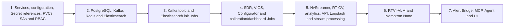

# NVIDIA Warehouse `bp_wh` Configuration Inventory

Status: **source-locked inventory; not a deployment manifest**
Inventory date: 2026-09-22

This document closes the component and initialization inventory needed before
the NVIDIA VSS 3.2.1 Warehouse Operations profile can be rendered for
OpenShift. It does not authorize a deployment or a GPU-mode switch.

## Evidence boundary

| Evidence | Locked value |
|---|---|
| NVIDIA repository | [`NVIDIA-AI-Blueprints/video-search-and-summarization`](https://github.com/NVIDIA-AI-Blueprints/video-search-and-summarization) |
| Release | [`v3.2.1`](https://github.com/NVIDIA-AI-Blueprints/video-search-and-summarization/releases/tag/v3.2.1) |
| Commit | [`7640d917047cf7b0fd3085eefb8282754b56bc94`](https://github.com/NVIDIA-AI-Blueprints/video-search-and-summarization/tree/7640d917047cf7b0fd3085eefb8282754b56bc94) |
| Profile | `MODE=2d`, `BP_PROFILE=bp_wh`, `STREAM_TYPE=kafka` |
| Dataset | `nvidia/vss-warehouse/vss-warehouse-app-data:3.2.0`; `nv-warehouse-4cams` |
| Hardware override | `HARDWARE_PROFILE=RTXPRO6000BW` |
| Local upstream checkout | None present in this repository or the inspected local source locations |
| Local source authority | [`NVIDIA-SOURCE-INVENTORY.md`](NVIDIA-SOURCE-INVENTORY.md) and [`source-lock.yaml`](../openshift/nvidia-warehouse/source-lock.yaml) |
| Runtime digest evidence | Accepted Search `imageID` inventory from 2026-09-21 and authenticated registry manifests from 2026-09-22 |

The resolved profile contains **40 Compose services**: 28 long-running
services and 12 one-shot or initialization services. The 3.2.1 release
intentionally mixes 3.2.0 and 3.2.1 component tags.

## Runtime component inventory

`Explicit probe: none` means the pinned Compose service has no health check.
It does not mean that an OpenShift probe may be omitted.

| # | Compose service | Function | Source image or build | Listener / publication | GPU source behavior | Explicit probe | Required gate or state |
|---:|---|---|---|---|---|---|---|
| 1 | `alert-bridge` | Convert analytics incidents into verified alerts | `nvcr.io/nvidia/vss-core/vss-alert-verification:3.2.0` | 9080; host network | None | None | Kafka healthy; Redis started; Elasticsearch healthy; topics initialized; RTVI-VLM healthy is marked optional |
| 2 | `bp-configurator-2d` | Apply the four-camera Warehouse blueprint configuration | `nvcr.io/nvidia/vss-core/vss-configurator:3.2.1` | 5001; host network | None | HTTP `/readyz`; 10s/5s/30; 60s start | `bp-configurator-2d-init` completed |
| 3 | `cadvisor` | Container telemetry | `ghcr.io/google/cadvisor:0.56.2` | host 18080 -> 8080 | None | None | Host filesystem and container-runtime access in Compose |
| 4 | `centralizedb` | VIOS PostgreSQL database | `postgres:17.9-alpine` | Unix socket in source profile | None | `pg_isready`; 5s/3s/60; 2s start | Persistent database volume |
| 5 | `dcgm-exporter` | NVIDIA GPU telemetry | `nvidia/dcgm-exporter:3.3.6-3.4.2-ubuntu22.04` | 9400 | Observes all visible GPUs | None recorded in profile | NVIDIA runtime and host GPU visibility |
| 6 | `elasticsearch` | Analytics/event index | Local derived image; base `docker.elastic.co/elasticsearch/elasticsearch:9.3.3` | 9200, 9300; host network | None | Cluster yellow; 10s/10s/60; 60s start | Persistent data and log volumes |
| 7 | `grafana` | Source-profile dashboards | `grafana/grafana:13.0.1-ubuntu` | host 35000 -> 3000 | None | None | Persistent dashboard state |
| 8 | `kafka` | Event transport | `confluentinc/cp-kafka:8.2.0` | 9092, 9093; host network | None | `kafka-topics --list`; 15s/15s/60; 60s start | Persistent broker data; automatic topic creation disabled |
| 9 | `kibana` | Warehouse analytics dashboards | `docker.elastic.co/kibana/kibana:9.3.3` | 5601; host network | None | HTTP `/kibana/api/status`; 10s/10s/60; 60s start | Elasticsearch healthy; dashboard initialization follows |
| 10 | `logstash` | Kafka-to-Elasticsearch ingestion | `docker.elastic.co/logstash/logstash:9.3.3` | No published application port | None | None | Broker gate and Elasticsearch initialization completed; installs unpinned protobuf codec at startup |
| 11 | `node-exporter` | Host telemetry | `quay.io/prometheus/node-exporter:v1.11.1` | host 19100 -> 9100 | None | None | Host `/proc` and `/sys` access in Compose |
| 12 | `nvidia-nemotron-nano-9b-v2` | Local Agent LLM | `nvcr.io/nim/nvidia/nvidia-nemotron-nano-9b-v2:1` | host 30081 -> 8000 | Device 2 | NIM ready, up to 600s, then live; 60s/650s/2 | Model cache and NGC entitlement |
| 13 | `nvstreamer-2d` | Replay the four MP4 camera sources as streams | `nvcr.io/nvidia/vss-core/vss-vios-nvstreamer:3.2.1` | HTTP 31000; RTSP 31554; RTP/UDP 31000-31200; optional gRPC 50051; host network | Reuses device 0 with RT-CV | None | Configurator healthy; read-only source videos |
| 14 | `perception-2d` | RT-CV detection and tracking | `nvcr.io/nvidia/vss-core/vss-rt-cv:3.2.1` | 9000; host network | Device 0 | None | SDR and sensor started; broker gate completed; model/engine storage |
| 15 | `phoenix` | Agent tracing | `arizephoenix/phoenix:14.15.0` | 6006 | None | None | Persistent trace state |
| 16 | `prometheus` | Source-profile metrics | `quay.io/prometheus/prometheus:v3.11.3` | 9090 | None | None | Source monitoring configuration |
| 17 | `redis` | Runtime coordination/cache | `redis:8.6.2-alpine` | 6379; host network | None | None | Persistent data/log paths |
| 18 | `rtvi-vlm` | Integrated Cosmos3 clip verification | `nvcr.io/nvidia/vss-core/vss-rt-vlm:3.2.1` | Intended host 8018 -> 8000 | Device 1; host IPC; 16 GiB shared memory | HTTP `/v1/health/ready`; 30s/10s/5; 1200s start | Broker gate is marked optional; NGC and Hugging Face caches |
| 19 | `sdr-controller` | Start/control Warehouse stream workloads | `nvcr.io/nvidia/vss-core/sdr-mw-l:3.2.0` | 5003, 8011, admin 9902; host network | None | None | Broker gate optional; directory and WDM environment initialization completed; Docker socket in Compose |
| 20 | `sensor-ms-2d` | VIOS sensor service | `nvcr.io/nvidia/vss-core/vss-vios-sensor:3.2.1` | 30000; host network | NVIDIA runtime; no device ID declared | TCP 30000; 10s/3s/20; 5s start | PostgreSQL healthy; Configurator wait and SDR started are optional gates |
| 21 | `streamprocessing-ms-2d` | VIOS stream processing and clip creation | `nvcr.io/nvidia/vss-core/vss-vios-streamprocessing:3.2.1` | 30001; host network | NVIDIA runtime; no device ID declared | TCP 30001; 20s/10s/75; 20s start | PostgreSQL healthy; Redis started |
| 22 | `vss-agent` | Warehouse conversational Agent and report generation | `nvcr.io/nvidia/vss-core/vss-agent:3.2.1` | 8000; host network | None | HTTP `/health`; 30s/10s/3; 240s start | Local LLM, RTVI-VLM, and VA MCP healthy; all three marked optional upstream |
| 23 | `vss-behavior-analytics-2d` | Spatial behavior, event, and incident analytics | `nvcr.io/nvidia/vss-core/vss-behavior-analytics:3.2.1` | 8080; host network | None | None | Broker gate completed; calibration and behavior configuration |
| 24 | `vss-haproxy-ingress` | Compose path routing | `haproxy:3.0-alpine` | 7777; host network | None | None | Generated HAProxy configuration |
| 25 | `vss-ui` | Reference Warehouse UI | `nvcr.io/nvidia/vss-core/vss-agent-ui:3.2.0` | 3000 | None | None | Agent healthy |
| 26 | `vss-va-mcp` | Video analytics MCP tool service | `nvcr.io/nvidia/vss-core/vss-agent:3.2.1` | 9901; host network | None | HTTP `/health`; 30s/10s/3; 40s start | VST and video analytics service endpoints |
| 27 | `vss-video-analytics-api-2d` | Query video analytics/events | `nvcr.io/nvidia/vss-core/vss-video-analytics-api:3.2.0` | 8081; host network | None | None | Broker gate and Elasticsearch initialization completed |
| 28 | `vst-ingress` | VIOS/VST media/API ingress | `nvcr.io/nvidia/vss-core/vss-vios-ingress:3.2.1` | 30888; host network | None | TCP 30888; 5s/3s/30; 2s start | Sensor healthy is marked optional |

Telemetry services `cadvisor`, `node-exporter`, Prometheus, Grafana, and the
profile DCGM exporter are candidates for replacement by OpenShift and GPU
Operator telemetry. They remain part of the upstream 28-service resolution
but are intentionally absent from the first OpenShift chart design.

## Initialization and generated-state inventory

| # | Compose service | Required action or generated output | Image/build input | Completion dependency | OpenShift translation |
|---:|---|---|---|---|---|
| 1 | `bp-configurator-2d-init` | Verify the broker path before Configurator startup | Local Kafka health-check image; base `confluentinc/cp-kafka:8.2.0` | Kafka reachable | Bounded Job or Configurator init container |
| 2 | `broker-health-check` | Establish a successful Kafka readiness gate | Same local Kafka health-check image | Kafka healthy | Bounded Job used by broker consumers |
| 3 | `elasticsearch-init-container` | Create/prepare required Elasticsearch state | Local `elastic-init.Dockerfile`; base `alpine:3.23.4` | Elasticsearch healthy | Idempotent Job |
| 4 | `import-calibration-output-container-2d` | Import the four-camera calibration output | Local `import-calibration.Dockerfile`; base `alpine:3.23.4` | Video Analytics API started | Idempotent calibration-import Job |
| 5 | `init-dirs` | Create writable SDR directories | `alpine:3.23.4` | Volumes mounted | Replace with PVC ownership/fsGroup or narrowly scoped init container |
| 6 | `kafka-topic-init-container` | Create the 21 explicit topics and topic settings | `confluentinc/cp-kafka:8.2.0` | Kafka healthy | Idempotent topic Job |
| 7 | `kibana-init-container-2d` | Import Warehouse dashboards | Local `kibana-dashboard.Dockerfile`; base `alpine:3.23.4` | Kibana healthy | Idempotent dashboard Job |
| 8 | `render-config` | Render SDR configuration from templates and environment | `alpine:3.23.4` | Source templates available | Prefer Helm-rendered ConfigMap; reject unresolved host-IP tokens |
| 9 | `sensor-bp-wait-bp-configurator` | Wait for Configurator readiness before VIOS sensor startup | `busybox:1.37.0` | Configurator `/readyz` | Bounded VIOS sensor init container |
| 10 | `wait-for-docker-workloads` | Poll Docker-managed workloads | `alpine:3.23.4` | WDM environment initialized | Eliminate; use Kubernetes readiness and service discovery, with no runtime socket |
| 11 | `wait-for-redis` | Gate SDR on Redis availability | `redis:8.6.2-alpine` | WDM environment initialized | Bounded SDR init container against `warehouse-redis:6379` |
| 12 | `wdm-env-from-config` | Derive `.wdm-env` from rendered SDR state | `alpine:3.23.4` | Directory and render steps completed | Eliminate generated env file; encode reviewed values directly |

The pinned source therefore needs **four derived helper images** if its Docker
build pattern is retained: Kafka health check, Elasticsearch initialization,
calibration import, and Kibana dashboard import. It also needs a derived
Elasticsearch image. Their base-image digests do not identify the derived
outputs.

## Kafka topic contract

Automatic topic creation is disabled. The topic Job creates the following
21 topics with replication factor 1, 8 partitions, retention 14,400,000 ms
(4 hours), and segment time 3,600,000 ms unless overridden. Only
`mdx-notification` uses 1 partition.

| Topic group | Topics |
|---|---|
| Detection and frames | `mdx-raw`, `mdx-frames`, `mdx-mtmc` |
| Behavior and spatial analytics | `mdx-bev`, `mdx-space-utilization`, `mdx-behavior`, `mdx-behavior-plus` |
| Alerts, events, and incidents | `mdx-alerts`, `mdx-vlm-alerts`, `mdx-notification` (1 partition), `mdx-events`, `mdx-incidents`, `mdx-vlm-incidents` |
| RTLS and robotics | `mdx-rtls`, `mdx-rtls-region-1`, `mdx-amr` |
| VLM and embeddings | `mdx-vlm`, `mdx-vlm-captions`, `mdx-structured-events-summary`, `mdx-embed`, `mdx-embed-filtered` |

The source configuration also references these names, but the active topic Job
does not create them:

- `alert-bridge-enhanced-alerts`
- `alert-bridge-incidents`
- `vision-llm-messages`
- `vision-llm-errors`

The Warehouse override changes the RTVI default
`vision-llm-events-incidents` to `mdx-vlm-incidents`. Deployment remains
blocked until each additional referenced topic is either explicitly created or
proved unused by this profile.

## Configuration asset contract

Paths below are relative to `deploy/docker/`. Hashes are SHA-256 values already
recorded against the pinned commit.

| Consumer | Source asset | SHA-256 | Treatment in OpenShift |
|---|---|---|---|
| Profile selector | `industry-profiles/warehouse-operations/.env` | `0c6242fb720e34a4d112ed80c26b75f1cb163c1b738a8b91835e1f1a16770857` | Split non-secret selection values from Secret references |
| Configurator | `industry-profiles/warehouse-operations/blueprint-configurator/blueprint_config.yml` | `966f61849217fbd7aaf1f1f5ac5407cdb91e961d2a7685297dd816a383a4c3ba` | Writable staged copy where upstream mutates configuration |
| Calibration | `industry-profiles/warehouse-operations/warehouse-2d-app/calibration/sample-data/nv-warehouse-4cams/calibration.json` | `37127a068d8a6775ab1a12cffa2634c477e6bc44f0833d7d918b3569fd64e1e0` | Immutable input to the calibration-import Job |
| Calibration map | `industry-profiles/warehouse-operations/warehouse-2d-app/calibration/sample-data/nv-warehouse-4cams/images/Top.png` | `4f4872bd6a1ce7ad0a3c00de0a7420183adebe9f27f7e9215f5c40e077b39ec7` | Immutable binary asset |
| Calibration metadata | `industry-profiles/warehouse-operations/warehouse-2d-app/calibration/sample-data/nv-warehouse-4cams/images/imageMetadata.json` | `c068bbd4d410dd4594e2523afdb57dfbd1ac20a9818e721c2ffc0d2c48dbb9c7` | Immutable input |
| Detector labels | `industry-profiles/warehouse-operations/warehouse-2d-app/deepstream/configs/ds-detector-labels.txt` | `c99e718f3e4ed3840f303b4d57919edafb9ae14e5fd1b4cfb419c8ded1b4461b` | RT-CV ConfigMap asset |
| DeepStream Kafka | `industry-profiles/warehouse-operations/warehouse-2d-app/deepstream/configs/ds-kafka-config.txt` | `47bfaeea2ac6743d94cfd75a3bd3981c7c7af30c219f94413b9e2adf79fc10c2` | Rewrite broker endpoint to Service DNS |
| DeepStream pipeline | `industry-profiles/warehouse-operations/warehouse-2d-app/deepstream/configs/ds-main-config.txt` | `24cf9ead36a2158f752b6916c1984e632b6690161c21ca1eec4fcec21011a07c` | RT-CV ConfigMap asset |
| NvDCF tracker | `industry-profiles/warehouse-operations/warehouse-2d-app/deepstream/configs/ds-nvdcf-accuracy-tracker-config.yml` | `65c83082d4dbe9bd84138c6a927c2a734a18dbc9615e8383a51d4d8712b813a5` | RT-CV ConfigMap asset |
| RT-DETR inference | `industry-profiles/warehouse-operations/warehouse-2d-app/deepstream/configs/ds-pgie-config.yml` | `e4394fb36f64db8b4a0c75047d176a26e53b66b1a5da85bfcaff390f79ce27f7` | RT-CV ConfigMap; model path targets the model PVC |
| DeepStream Redis | `industry-profiles/warehouse-operations/warehouse-2d-app/deepstream/configs/ds-redis-config.txt` | `e21a6634f37a1319513dfcffc788bb5bc0a06186c967cfc6d6311dea9d2bfee9` | Rewrite Redis endpoint to Service DNS |
| NvStreamer VST | `industry-profiles/warehouse-operations/warehouse-2d-app/nvstreamer/configs/vst-config.json` | `b45e7c9b76b13f76eace1e2958b6cfba8a35fcaa5e0b2f3400c3ac8fc2a0ba8c` | NvStreamer ConfigMap asset |
| NvStreamer storage | `industry-profiles/warehouse-operations/warehouse-2d-app/nvstreamer/configs/vst-storage.json` | `e8c718d1f9288965692fcb3ac88d43b927eac0d8f598f462a6eca9a328daa8f6` | Rewrite storage paths to mounted volumes |
| SDR base | `industry-profiles/warehouse-operations/warehouse-2d-app/sdrc/configs/config.yml.tmpl` | `612b7926708bc94cca8849540c3da2ab86f894681f862509dcefb3d49472c268` | Render to ConfigMap with Service DNS |
| SDR alerts cluster | `industry-profiles/warehouse-operations/warehouse-2d-app/sdrc/configs/docker_cluster_config-alerts-2d.json.tmpl` | `0822af0dae686758c49ecd8ef8c6653534cc37928a3380c4a668143b65c8b1c7` | Translate Docker workload names to Kubernetes discovery |
| SDR RT-CV cluster | `industry-profiles/warehouse-operations/warehouse-2d-app/sdrc/configs/docker_cluster_config-rtvi-cv.json.tmpl` | `31e0b42715ccb233194f6e79003c8a1c5df4a73f9a78e2a1f573f431b4667127` | Translate endpoints and controller names |
| SDR stream-processing cluster | `industry-profiles/warehouse-operations/warehouse-2d-app/sdrc/configs/docker_cluster_config-streamprocessing.json.tmpl` | `37a13d3ff1094f3c98f70a270b09f0c88112b0ed140f07566fbc17e54fab4a17` | Translate endpoints and controller names |
| Behavior analytics | `industry-profiles/warehouse-operations/warehouse-2d-app/vss-behavior-analytics/configs/vss-behavior-analytics-config.json` | `8424ac5a6f1ce041716bf00f057514a306f684ad93d938cbfdc7b82638b3e887` | ConfigMap asset; preserve proximity/tripwire rules |
| VIOS/VST | `industry-profiles/warehouse-operations/warehouse-2d-app/vst/configs/vst_config.json` | `db5d7ca6e3fb37489758fae2c9a874e0cb16cfff12d667ee573abff70ddd90ec` | Rewrite endpoints and storage paths |
| VLM real-time rules | `industry-profiles/warehouse-operations/vlm-as-verifier/realtime-config.yml` | `d4413303c99da27a5aa2781d01e46fb28c05c45e54b4b155cdf8e55f26b40aca` | RTVI-VLM ConfigMap asset |
| Alert type mapping | `industry-profiles/warehouse-operations/vlm-as-verifier/configs/alert_type_config.json` | `d7fd8c3b744a749f589759e18c5d0037a520e8b443e49997cdf6302067b97e85` | Alert Bridge/RTVI ConfigMap asset |
| VLM verifier | `industry-profiles/warehouse-operations/vlm-as-verifier/configs/config.yml` | `5f270907409f22a57c9e87fd9291d668d67ea6b21a4f7033adee0aba7a09dbd1` | Rewrite Kafka, Redis, VST, and model endpoints |
| Agent | `industry-profiles/warehouse-operations/vss-agent/configs/config.yml` | `0d922090a1ebcf6f4ab6d1d16378dae9be67afc7a82e63d532d662bdb3ee4bd6` | Rewrite model, MCP, VST, and Phoenix endpoints |
| MCP | `industry-profiles/warehouse-operations/vss-agent/configs/va_mcp_server_config.yml` | `b1cc6cf0213fc368d8c558a32ec5f5eec04d4391303cfa6d2ada4db69ce4afc8` | Rewrite internal service endpoints |
| Report template | `industry-profiles/warehouse-operations/vss-agent/templates/incident_report_template.md` | `826cf947a37b7e151c50422812f373b76f57cd89c93f5dcc1457fa8aa6a7e5e1` | Immutable Agent asset |
| VIOS environment | `services/vios/vst.env` | `f430d16501a3e66e349f7e0d8195ec18fa113b9a2b9a2157c71e9465d0224bc7` | Split non-secret values from Secret references |
| VST proxy | `services/vios/configs/nginx-vst.conf` | `8a095b07cab077fba4667200606c990bd6838e19d634158dcaaac73c0ba4e690` | Translate to Service/Route behavior |
| PostgreSQL | `services/vios/configs/postgresql.conf` | `65e52049144c5bc4b1722f1d450ec6b0c5facfc218f4d12694fd4f2dbf451618` | PostgreSQL ConfigMap asset |
| HAProxy | `services/infra/haproxy/haproxy.cfg.template` | `c13922297c2d53d5f0b532eaba05bc8b8616836fc552f9ebc152c83a0dbb3343` | Prefer OpenShift Routes; retain only if path tests prove required |

The upstream Configurator writes and backs up some application configuration.
Do not mount a ConfigMap directly at a path it must modify. Stage an initial
copy onto a writable volume or render the final immutable configuration before
startup.

## Service-address translation

These are the reviewed namespace-local targets for the first OpenShift render.

| Source assumption | OpenShift Service target |
|---|---|
| `localhost:9092` or `$HOST_IP:9092` | `warehouse-kafka:9092` |
| `localhost:6379` or `$HOST_IP:6379` | `warehouse-redis:6379` |
| `localhost:9200` | `warehouse-elasticsearch:9200` |
| `localhost:5001` | `warehouse-configurator:5001` |
| `$HOST_IP:8018` | `warehouse-rtvi-vlm:8000` |
| `$HOST_IP:8000` | `warehouse-agent:8000` |
| `$HOST_IP:9901` | `warehouse-va-mcp:9901` |
| `$HOST_IP:9080` | `warehouse-alert-bridge:9080` |
| `$HOST_IP:30888` | `warehouse-vios-ingress:30888` |
| `localhost:30000` | `warehouse-vios-sensor:30000` |
| `localhost:30001` | `warehouse-vios-streamprocessing:30001` |
| `$HOST_IP:31000` | `warehouse-nvstreamer:31000` |
| `$HOST_IP:6006` | `warehouse-phoenix:6006` |

`RTVI_VLM_PORT` is required by the Compose service but absent from the locked
Warehouse `.env`. The existing source audit proposes `8018`, matching the
profile's URLs. That value is still a validation item; it is not silently
treated as an upstream default.

## Persistent and writable data inventory

| Data class | Source mount or named volume | OpenShift requirement |
|---|---|---|
| Four sample videos | `${VSS_DATA_DIR}/videos/nv-warehouse-4cams` | Read-only shared dataset mount for NvStreamer |
| RT-DETR model and TensorRT engine | `${VSS_DATA_DIR}/models/mtmc` -> RT-CV `/opt/storage` | Retained model/engine PVC; engine build must survive restart |
| VIOS database | `vios_pg_data`; `${VSS_DATA_DIR}/data_log/vst` database subpath | PostgreSQL PVC |
| VIOS recorded video | `${VSS_DATA_DIR}/data_log/vst` video subpath | Retained media PVC with tested range-read behavior |
| VIOS clips | `${VSS_DATA_DIR}/data_log/vst` clip subpath | Retained clip PVC shared only with required consumers |
| VIOS temporary files and logs | VST temp/log subpaths | `emptyDir` for disposable temp; retained log storage only if required |
| Kafka | `mdx-kafka`; `${VSS_DATA_DIR}/data_log/kafka` | Broker PVC |
| Elasticsearch | `mdx-elastic-data`, `mdx-elastic-logs` | Separate data and log PVCs or an approved combined layout |
| Redis | `${VSS_DATA_DIR}/data_log/redis/{data,log}` | Redis data PVC; log handling through platform logging where possible |
| Nemotron cache | `nvidia_nemotron_nano_9b_v2_cache` | Retained NIM model cache |
| RTVI caches | `rtvi-hf-cache`, `rtvi-ngc-model-cache` | Separate retained model caches sized from actual payloads |
| Agent objects/reports | `agent-eval` and Agent object storage | Retained Agent report/object PVC if enabled |
| Phoenix | `phoenix-data` | Retained trace PVC if Phoenix remains enabled |
| Grafana | `grafana-storage` | Omit when OpenShift monitoring replaces source Grafana |
| Logstash plugin | `mdx-logstash-libs` | Replace runtime plugin install with a pinned derived image |
| SDR state | `./log`, `./.wdm-env`, Docker socket | Logs to platform/`emptyDir`; encode env directly; prohibit Docker/CRI socket mounts |

PVC sizes and access modes in the current Helm skeleton are provisional. They
are not source-verified sizing values.

## Startup order for the OpenShift render

Kubernetes object creation order is not a readiness mechanism. Each consumer
must remain NotReady and retry safely until its dependency API is usable.

The profile's optional Compose dependencies are not sufficient OpenShift
acceptance gates. The Agent, for example, is not functionally ready without its
LLM, RTVI-VLM, and MCP services even though Compose marks those dependencies
optional.

## Immutable image evidence

The following tag-to-digest pairs combine accepted NVIDIA Search runtime
`imageID` evidence from September 21, 2026 with authenticated registry manifest
evidence from September 22, 2026. The Warehouse render retains the exact
repository and tag and pins the corresponding immutable manifest digest.

| Warehouse source image | Observed immutable image |
|---|---|
| `confluentinc/cp-kafka:8.2.0` | `docker.io/confluentinc/cp-kafka@sha256:acbbf674f2ed40e5d0a8ca51beb0f00692c866fc22b5ce06f8cadbdc54cd4436` |
| `postgres:17.9-alpine` | `docker.io/library/postgres@sha256:c7526c0f6c3f30260a563d7bcf8ad778effac59a44f8ffa86678c35418338609` |
| `docker.elastic.co/elasticsearch/elasticsearch:9.3.3` | `docker.elastic.co/elasticsearch/elasticsearch@sha256:49ee53827c7cf1e6048f9de743878f9f56372617ef98b58168cad1f81dc7d847` |
| `docker.elastic.co/kibana/kibana:9.3.3` | `docker.elastic.co/kibana/kibana@sha256:36301dc49650e47484b23803d60f78e0ac763ab4d7edab6c75c1f54a186d5f9d` |
| `docker.elastic.co/logstash/logstash:9.3.3` | `docker.elastic.co/logstash/logstash@sha256:609e51b1accde023bff27a21c30ab0660475a5c20b2a78ef8239520d4a196adb` |
| `redis:8.6.2-alpine` | `docker.io/library/redis@sha256:c5e375abb885e6b2021c0377879e4890bf76f9065b8922ffc113f2b226b9fc17` |
| `arizephoenix/phoenix:14.15.0` | `docker.io/arizephoenix/phoenix@sha256:4902edc412785dcd90ad20172c3b15def87d076a18cfc3c3df44df211993f0f0` |
| `nvcr.io/nvidia/vss-core/vss-alert-verification:3.2.0` | `nvcr.io/nvidia/vss-core/vss-alert-verification@sha256:a36745d216ca2396acb2491c75f3af05884e207e782c445e76b06df4976aa275` |
| `nvcr.io/nvidia/vss-core/vss-configurator:3.2.1` | `nvcr.io/nvidia/vss-core/vss-configurator@sha256:35e3e31e7d9e62b298d6dbcb91244d54b0686845227f26e46f886493e9fe4504` |
| `nvcr.io/nvidia/vss-core/sdr-mw-l:3.2.0` | `nvcr.io/nvidia/vss-core/sdr-mw-l@sha256:49cdff1ffc5314b82e2339ee28c67bd5055dc6f66ea9fa8fcccb0780dc8cd150` |
| `nvcr.io/nvidia/vss-core/vss-agent:3.2.1` | `nvcr.io/nvidia/vss-core/vss-agent@sha256:b7f3246aaf355ebf96e91a40b2f0abc5dea7e330e7bf9a7cf726107b560c3ac1` |
| `nvcr.io/nvidia/vss-core/vss-agent-ui:3.2.0` | `nvcr.io/nvidia/vss-core/vss-agent-ui@sha256:6362151a839067f517766f1997a19c302296fe80b9b0251aaee8f16b379503d9` |
| `nvcr.io/nvidia/vss-core/vss-behavior-analytics:3.2.1` | `nvcr.io/nvidia/vss-core/vss-behavior-analytics@sha256:1dfb51a6592a4fe804487309193c651466258f7b6e90d30fcf403f28374552b1` |
| `nvcr.io/nvidia/vss-core/vss-rt-cv:3.2.1` | `nvcr.io/nvidia/vss-core/vss-rt-cv@sha256:1a8b9879686f21cb6b9589d6139b5ac2eb960f1520aa3b4bb5f079d05fee9458` |
| `nvcr.io/nvidia/vss-core/vss-rt-vlm:3.2.1` | `nvcr.io/nvidia/vss-core/vss-rt-vlm@sha256:5403e0c8fa8b149e7ad15ab1b063b78d610e7a50297dba6ca550ac5cc5ef9504` |
| `nvcr.io/nvidia/vss-core/vss-video-analytics-api:3.2.0` | `nvcr.io/nvidia/vss-core/vss-video-analytics-api@sha256:2aef26ab5a7394b42da75c53169a9efaf8d2c9278d19de2a214586aafd5e082d` |
| `nvcr.io/nvidia/vss-core/vss-vios-ingress:3.2.1` | `nvcr.io/nvidia/vss-core/vss-vios-ingress@sha256:631c25cd970a1bcdb1e2a32cab834959276ea2da97698b310fd9b4c9e9e57d14` |
| `nvcr.io/nvidia/vss-core/vss-vios-nvstreamer:3.2.1` | `nvcr.io/nvidia/vss-core/vss-vios-nvstreamer@sha256:7074784d32f996734ef091405f14965573d40257d843bba29d7ca2ef36f58e4d` |
| `nvcr.io/nvidia/vss-core/vss-vios-sensor:3.2.1` | `nvcr.io/nvidia/vss-core/vss-vios-sensor@sha256:6dd443f43acd52b00c449238907f38a936d8e3f5d7fb77765d4ece82b3c24cc7` |
| `nvcr.io/nvidia/vss-core/vss-vios-streamprocessing:3.2.1` | `nvcr.io/nvidia/vss-core/vss-vios-streamprocessing@sha256:c39392210816ae0f4c41576a6b8b4c2b664c05f7808e25b6fcc95854beffc5c9` |
| `nvcr.io/nim/nvidia/nvidia-nemotron-nano-9b-v2:1` | `nvcr.io/nim/nvidia/nvidia-nemotron-nano-9b-v2@sha256:a2f4a5aefe7dd0ff29bfd8d7081ce4977337d1b12081361af7b6283ff9a406b2` |

### Important digest limits

- The Elasticsearch digest above identifies the upstream **base** image. The
  Warehouse source builds a derived Elasticsearch image, whose digest remains
  unresolved.
- The Kafka and Alpine base digests do not identify the four derived helper
  images.
- The Logstash image is resolved, but the unpinned protobuf codec installed at
  startup prevents a fully immutable runtime.
- A running `imageID` is architecture-specific evidence from the accepted
  cluster, not a vendor support statement or a multi-architecture index lock.

These locally built Warehouse images remain unresolved from existing evidence:

- the derived Elasticsearch image
- the four derived helper/init images

The pinned Alert Verification, Configurator, RTVI-VLM, and Nemotron Nano tags
were all resolved on September 22, 2026 with the existing NGC API key. A
separate Service Key was not required for these repositories in the validated
organization. Per-image manifest and `linux/amd64` platform digests and the
temporary-login verification command are recorded in
[`NGC-IMAGE-RESOLUTION.md`](NGC-IMAGE-RESOLUTION.md).

The separate registry-resolution pass locked `haproxy:3.0-alpine` and the
other public source images. The complete 29-resolved/0-unresolved tag inventory
is recorded in [`source-lock.yaml`](../openshift/nvidia-warehouse/source-lock.yaml).

The source telemetry images and their digests do not block the first render if
OpenShift and GPU Operator telemetry replace them as designed.

## Render-blocking conclusions

The next chart revision may use the inventory above, but it is not ready for a
cluster apply until all of these are closed:

1. Retain the 21 reusable chart-image digests and build, publish, and pin every
   locally derived image output.
2. Package the hashed configuration and calibration assets without mutable
   ConfigMap mounts.
3. Add the 12 initialization translations, including the exact 21-topic Job
   and a decision on the four additional topic references.
4. Add upstream-derived probes where available and evidence-based probes for
   services that have none; do not invent success endpoints.
5. Replace host networking, host IPC, host paths, runtime sockets, and
   `localhost`/host-IP service discovery.
6. Resolve the shared device-0 assumption and verify whether VIOS sensor and
   stream processing actually require GPU requests.
7. Validate the complete rendered startup chain, storage retention, and SCC
   admission on OpenShift/Kubernetes 1.33.9.

No namespace, Helm release, Secret, PVC, replica, node scheduling state, or
stored data was changed while producing this inventory.
