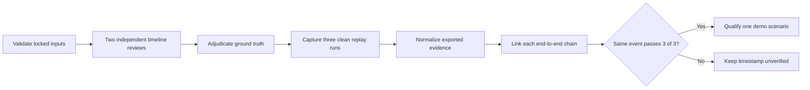

# Warehouse alert evidence scoring

Status: local tooling ready; the four source timelines and alert timestamps are
still unscored



This procedure scores the five stock Alerts UI rules: Near Miss, PPE, Load
Quality, Pathway Obstruction, and Spillover. ROI/tripwire records remain
analytics evidence. Worker fall is not a stock rule and is outside this gate.

The scoring utility is local-only. It does not connect to OpenShift, change a
workload, copy video, or retain raw Kafka, Elasticsearch, Alerts UI, log, or
report payloads.

## Required inputs

| Input | Requirement |
|---|---|
| Source manifest | [`../data/warehouse-data-manifest.yaml`](../data/warehouse-data-manifest.yaml) |
| Scoring definitions | [`../data/ALERT-SCENARIO-MATRIX.md`](../data/ALERT-SCENARIO-MATRIX.md) |
| Media | Original four-camera files and archive at their retained location; do not copy them into this repository |
| NVIDIA profile | Repository at commit `7640d917047cf7b0fd3085eefb8282754b56bc94` |
| Reviewers | Two different people who label before viewing system output |
| Run evidence | Three clean 0-600 second replays with unique run IDs |
| Presentation permission | Separately confirmed before showing NVIDIA media externally |

Use Python 3.10 or later. The utility has no third-party Python dependency.

## 1. Validate the manifest and locked files

Structure-only validation is safe when the retained media or NVIDIA checkout
is not mounted:

```bash
python3 demos/warehouse-operations/scripts/warehouse_alert_scoring.py \
  validate-manifest \
  --manifest demos/warehouse-operations/data/warehouse-data-manifest.yaml
```

For the scoring run, also verify every retained byte against the manifest.
Set these values to the retained, read-only locations:

```bash
WAREHOUSE_MEDIA_ROOT=/path/to/extracted/warehouse-data
WAREHOUSE_ARCHIVE=/path/to/vss-warehouse-app-data.tar.gz
WAREHOUSE_PROFILE_ROOT=/path/to/video-search-and-summarization
```

```bash
python3 demos/warehouse-operations/scripts/warehouse_alert_scoring.py \
  validate-manifest \
  --manifest demos/warehouse-operations/data/warehouse-data-manifest.yaml \
  --media-root "$WAREHOUSE_MEDIA_ROOT" \
  --archive "$WAREHOUSE_ARCHIVE" \
  --profile-root "$WAREHOUSE_PROFILE_ROOT"
```

Pass requires `media hashes 4/4`, `configuration hashes 5/5`, and `archive
hash 1/1`. Stop on any mismatch. Structure-only validation does not substitute
for the full hash check.

## 2. Create a non-overwriting scoring workspace

Keep raw exports and working evidence outside the publishable repository. Use
a path dedicated to this run:

```bash
WAREHOUSE_SCORE_DIR=/path/to/warehouse-alert-run
```

```bash
python3 demos/warehouse-operations/scripts/warehouse_alert_scoring.py \
  init-workspace \
  --manifest demos/warehouse-operations/data/warehouse-data-manifest.yaml \
  --output-dir "$WAREHOUSE_SCORE_DIR" \
  --reviewer reviewer-a \
  --reviewer reviewer-b
```

The command creates:

| File | Purpose |
|---|---|
| `reviewer-a-labels.csv`, `reviewer-b-labels.csv` | Independent timeline completion and candidate labels |
| `adjudicated-labels.csv` | Final ground truth, prepared before system evidence is opened |
| `evidence.csv` | Whitelisted normalized identifiers and scoring fields |
| `scenario-runs.csv` | Evidence-ID lineage for each of three replay iterations |
| `run-metadata.json` | Source, image, model, configuration, and run identity record |
| `SCORING-CHECKLIST.md` | Per-run operator checklist |

The initializer refuses to overwrite any of these files.

## 3. Label and adjudicate the source video

Each reviewer independently watches all four complete timelines. In their own
CSV:

1. Change each seeded `timeline_review` row from `timeline_reviewed=no` to
   `timeline_reviewed=yes` only after reviewing source seconds 0-600.
2. Record `review_completed_utc` in UTC.
3. Append one `candidate` row for each observed candidate window.
4. Use a unique `label_id`, the exact sensor and stock rule, `positive`,
   `negative`, or `uncertain`, a source-relative start/end, and concise visible
   facts.
5. Duplicate a candidate row as needed; do not combine separate events into
   one interval.

Do not use an Alerts UI timestamp, Kafka record, model answer, or system clip
to create the human label.

Adjudicate disagreements into `adjudicated-labels.csv`. Every row needs a
stable `ground_truth_id`, the contributing reviewer label IDs, and
`adjudication_status=accepted` or `excluded`. Only an accepted `positive` row
can enter the reproducibility gate. If the footage has no clear positive for a
rule, record that outcome; do not tune a prompt or threshold to manufacture
one during the baseline.

Complete `run-metadata.json` with the exact source commit, source and
configuration hash verification state, image digests, model IDs, and unique
run IDs. Do not place credentials, private URLs, absolute workstation paths,
or raw logs in the workspace.

Before scoring, set `status` to `ready_for_scoring`; set the three hash
verification booleans to `true` only after the full check passes. Record each
image as `{"component":"<name>","image":"<repository>@sha256:<digest>"}` and
record at least the perception, VLM, and Agent LLM models as
`{"role":"<role>","model_id":"<exact-id>"}`. The `run_ids` list must exactly
match the three evidence runs. Do not change the source, archive, configuration
lock, manifest hash, dataset, or profile-commit fields seeded by the tool.

## 4. Capture and normalize three runs

For each iteration, start all four sources at source second 0 and stop scoring
at second 600. Later replay loops are outside the scoring window. Preserve the
raw exports outside the repository under a unique run ID.

The importer accepts CSV, JSON, JSON Lines, Elasticsearch `hits.hits`, and
common `records`, `items`, `events`, or `alerts` arrays. It writes only the
columns in `evidence.csv`; it does not copy raw payloads. It stores the export
filename, record number, and SHA-256 to retain provenance. Obvious credential
fields cannot be mapped, and `clip_ref` must be a sanitized ID rather than a
URL or absolute path.

Example for a Kafka JSON Lines export whose message is under `value`:

```bash
python3 demos/warehouse-operations/scripts/warehouse_alert_scoring.py \
  ingest-evidence \
  --input /path/to/run-1-mdx-incidents.jsonl \
  --output "$WAREHOUSE_SCORE_DIR/evidence.csv" \
  --run-id warehouse-run-1 \
  --iteration 1 \
  --type behavior \
  --map sensor_id=value.sensorId \
  --map rule=value.category \
  --map incident_id=value.incidentId \
  --map source_start_seconds=value.startSeconds \
  --map source_end_seconds=value.endSeconds
```

Example for an Elasticsearch or Alerts export using built-in field aliases:

```bash
python3 demos/warehouse-operations/scripts/warehouse_alert_scoring.py \
  ingest-evidence \
  --input /path/to/run-1-alerts.json \
  --output "$WAREHOUSE_SCORE_DIR/evidence.csv" \
  --run-id warehouse-run-1 \
  --iteration 1 \
  --type alerts_ui
```

Use a separate import for each evidence class:

| `--type` | Minimum useful fields |
|---|---|
| `perception` | Sensor, source interval when supplied, object class, track ID, Kafka coordinates |
| `behavior` | Sensor, rule/category, interval, event/incident ID, Kafka coordinates |
| `vlm` | Sensor, rule, incident or alert ID, interval, verdict or class `0` / `Yes`, model ID, configuration hash, latency |
| `delivery` | Sensor, rule, incident ID when applicable, alert ID, successful status, Elasticsearch coordinates |
| `alerts_ui` | Sensor, rule, source interval, alert ID, `confirmed` near-miss verdict or class `0` / `Yes` |
| `clip` | Sensor, rule, alert ID, sanitized clip ID, `clip_playable=true` |
| `agent_report` | Sensor, rule, alert ID, `report_grounded=true`; do not import report prose |
| `health` | Run identity and `health_ok=true`; retain detailed sanitized health evidence separately |

Repeat the imports with replay iterations 2 and 3 and distinct run IDs. An
identical export cannot be imported twice for the same run/type/iteration.

If built-in aliases do not match an export, add one or more
`--map normalized_field=source.path` arguments. Do not map payload prose or a
credential-bearing field merely to preserve it.

## 5. Link the end-to-end chain

Populate one `scenario-runs.csv` row per replay iteration. A candidate scenario
therefore has exactly three rows, all referencing the same
`ground_truth_id`, with iterations 1, 2, and 3 and three unique run IDs.
Multiple evidence IDs in a plural column use semicolons.

For Near Miss, each row must reference perception, behavior, VLM, delivery,
Alerts UI, clip, Agent report, and health evidence. Behavior, VLM, and delivery
must share one incident ID. Delivery, Alerts UI, clip, and report must share
one alert ID.

For PPE, Load Quality, Pathway Obstruction, and Spillover, each row must
reference VLM, delivery, Alerts UI, clip, Agent report, and health evidence.
Perception and behavior may be linked when present but are not prerequisites
for these direct real-time VLM rules.

Set `prediction_evidence_id` and `alerts_ui_evidence_id` to the same final
Alerts UI evidence record. The scorer independently verifies that every
referenced record belongs to the stated run/iteration and agrees with the
ground-truth sensor and rule.

## 6. Score and enforce the gate

```bash
python3 demos/warehouse-operations/scripts/warehouse_alert_scoring.py \
  score \
  --manifest demos/warehouse-operations/data/warehouse-data-manifest.yaml \
  --run-metadata "$WAREHOUSE_SCORE_DIR/run-metadata.json" \
  --reviewer-labels "$WAREHOUSE_SCORE_DIR/reviewer-a-labels.csv" \
  --reviewer-labels "$WAREHOUSE_SCORE_DIR/reviewer-b-labels.csv" \
  --ground-truth "$WAREHOUSE_SCORE_DIR/adjudicated-labels.csv" \
  --evidence "$WAREHOUSE_SCORE_DIR/evidence.csv" \
  --scenario-runs "$WAREHOUSE_SCORE_DIR/scenario-runs.csv" \
  --output-json "$WAREHOUSE_SCORE_DIR/score.json" \
  --output-markdown "$WAREHOUSE_SCORE_DIR/score.md" \
  --require-pass
```

`--require-pass` exits nonzero unless at least one supported scenario completes
the required chain in all three runs and the input-lock metadata is complete.
The scorer also requires both reviewers to have completed all four timelines,
and every accepted ground-truth row must reference overlapping labels from
both reviewers. It matches sensor and rule and requires at least one second of
source-interval overlap. It reports TP, FP, FN, precision, recall, duplicate
predictions, rejected results, unverified/failed results, and mean reported
latency by iteration, rule, and camera.

## Test questions and pass criteria

| Question | Pass criterion |
|---|---|
| Were inputs unchanged? | 4/4 source files, 5/5 configurations, and 1/1 archive match the manifest |
| Is ground truth independent? | Two complete timeline reviews and adjudication predate inspection of system output |
| Is the event the same? | One accepted positive `ground_truth_id` is used for all three iterations |
| Does the prediction match? | Sensor and rule match and the predicted interval overlaps ground truth by at least one second |
| Is the result positive? | Near Miss is `confirmed`; an always-on rule is class `0` / `Yes` |
| Is lineage complete? | Required evidence IDs exist in the same run and required incident/alert IDs agree |
| Can an operator inspect it? | The correct clip is marked playable and the Alerts UI row is retained |
| Is the Agent result grounded? | The report is explicitly checked against retained event/video evidence in all three runs |
| Is it reproducible? | Exactly one passing row for each iteration 1, 2, and 3 with stable verdict/class |
| May it be presented? | Scorer returns `PASS` and presentation permission is separately confirmed |

Until every pass criterion is met, keep
`scenario_scoring.verified_alert_timestamps` empty and
`selected_demo_scenario` null in the source manifest.
