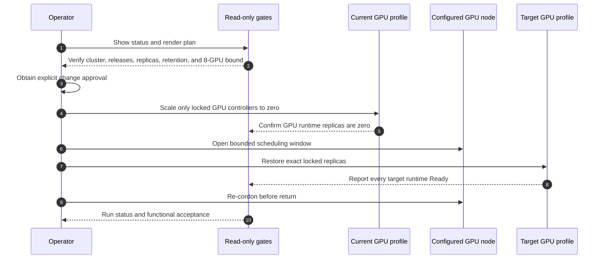

# Warehouse and CVD Base Profile Switching

Status: **implementation starter; plan-only and not yet deployable**. Warehouse
execution remains blocked until the final Helm render replaces every
controller placeholder in a site-specific `profiles.yaml` and the complete
switch has passed the acceptance procedure below.



## Purpose and invariants

This procedure lets the Warehouse profile use any reviewed GPU allocation from
one through all eight GPUs. This is a capacity policy; the final render locks
one concrete controller map and GPU count. It does not reserve GPUs for the base profile
while Warehouse is active. The reverse operation restores the exact configured
CVD baseline: NVIDIA VSS Search, VAST-native VSS Search, and the shared NIMs.

The switch is a replica operation, not an installation or cleanup operation.
It must never delete a Helm release, namespace, PVC/PV, NIM cache, S3 object,
VASTDB row, Kafka topic, Elasticsearch index, or video. CPU services and
stateful data planes remain installed. The configured GPU node must begin and
end every operation cordoned.

`profiles.yaml` is valid JSON as well as YAML so the scripts can parse it with
the Python standard library; no unpinned YAML package is required.

## Required inputs

- Repository checkout on an OpenShift administration client.
- `oc`, `helm`, and `python3` in `PATH`.
- A kubeconfig context with the required OpenShift administration access.
- A local `profiles.yaml` created from `profiles.example.yaml` and completed
  with verified site values.
- Explicit change approval for any replica or node-scheduling mutation.
- Exact execution acknowledgement:
  `GPU_MODE_SWITCH_APPROVED_PRESERVE_ALL_DATA`.
- A resolved Warehouse controller inventory before the first executable
  switch. The provisional five-controller list is not authorization to deploy
  or switch it.

## Source-locked base profile

The example base profile records three Helm releases and the eight GPU
controllers below, each with one desired and one Ready runtime replica and one
GPU per replica. After copying `profiles.example.yaml` to `profiles.yaml`,
replace the example release revisions and controller lock with values verified
in the target environment.

| Namespace | Replica authority | Generated/runtime workload | Locked replicas | GPUs |
|---|---|---|---:|---:|
| `nims` | `NIMService/embedding` | `Deployment/embedding` | 1 | 1 |
| `nims` | `NIMService/reranker` | `Deployment/reranker` | 1 | 1 |
| `nims` | `NIMService/llm-nemotron-35-lightning` | `Deployment/llm-nemotron-35-lightning` | 1 | 1 |
| `nims` | `NIMService/vss-cosmos-reason2-8b-170` | `Deployment/vss-cosmos-reason2-8b-170` | 1 | 1 |
| `nvidia-vss-321-search` | `NIMService/nvidia-cosmos3-reasoner` | `Deployment/nvidia-cosmos3-reasoner` | 1 | 1 |
| `nvidia-vss-321-search` | `Deployment/vss-rtvi-embed` | same | 1 | 1 |
| `nvidia-vss-321-search` | `StatefulSet/vss-rtvi-cv` | same | 1 | 1 |
| `nvidia-vss-321-search` | `StatefulSet/vss-vios-streamprocessing` | same | 1 | 1 |

The two GPU StatefulSets report `Retain` for both `whenScaled` and
`whenDeleted`. Scaling still does not authorize deletion; the switch scripts
contain no delete, uninstall, install, or upgrade operation.

## Stage 1 — Read-only status and plan

Run from the repository root on the OpenShift administration client. Set the
GPU node name from the completed local profile:

```bash
GPU_NODE=replace-with-gpu-node

oc whoami
oc whoami --show-server
oc config current-context
oc get clusterversion
oc get node "$GPU_NODE"

demos/warehouse-operations/scripts/show-status.sh
demos/warehouse-operations/scripts/set-demo-mode.sh warehouse
```

The last command is always plan-only unless `--execute` is supplied. It prints
the exact prospective `oc patch`, `oc scale`, uncordon, and cordon commands.
It currently reports `EXECUTION BLOCKED` because the Warehouse chart has not
yet supplied a complete, admitted GPU-controller inventory.

Pass criteria:

- Identity, API, context, OpenShift, and Kubernetes match `profiles.yaml`.
- The configured GPU node is Ready, cordoned, and exposes the capacity recorded
  in `profiles.yaml`.
- Retained Helm release status and revisions match the lock.
- Base controller names, replica states, pod-template GPU requests, and
  StatefulSet claim-retention policies match.
- The summed target request is no more than eight GPUs.
- No command in the plan deletes or reinstalls a resource.

## Stage 2 — Close the Warehouse render gate

After the Warehouse Helm chart is complete, use only read-only render and
server-side dry-run evidence to update `profiles.yaml`:

1. Replace `__SET_FROM_FINAL_HELM_RENDER__` with the exact namespace.
2. Replace or extend the provisional list with every rendered controller that
   requests `nvidia.com/gpu`.
3. Record the exact kind, name, source replica count, GPU request per replica,
   generated runtime workload, and safe start/stop order.
4. Set each controller's `resolved` field to `true`.
5. Set `controller_inventory_complete` and the Warehouse profile `resolved`
   field to `true`.
6. Set `locked_gpu_request` to the exact controller sum. A value from one
   through eight is permitted; more than eight is rejected.
7. Add the deployed Warehouse Helm release, verified revision, namespace, and
   retained PVC inventory to `retained_data_planes`, then set
   `retained_data_plane_registered=true`.
8. Rerun `show-status.sh` and both target plans. Do not execute if the live
   resources differ from the reviewed render.

This gate must follow Helm lint, static render audit, Kubernetes 1.33.9
server-side dry-run, SCC review, and approval. It does not deploy Warehouse.

## Stage 3 — Switch to Warehouse after approval

First render and review the plan again:

```bash
demos/warehouse-operations/scripts/set-demo-mode.sh warehouse
```

Only after explicit approval of that exact plan, run:

```bash
demos/warehouse-operations/scripts/set-demo-mode.sh warehouse \
  --execute \
  --ack GPU_MODE_SWITCH_APPROVED_PRESERVE_ALL_DATA
```

The script performs these bounded actions:

1. Verifies the exact active/stopped profile signature, GPU Operator state,
   retained PVCs, and capacity before changing a replica.
2. Scales the eight source-locked base GPU controllers to zero while
   the configured GPU node remains cordoned and rechecks capacity.
3. Temporarily uncordons the configured GPU node.
4. Starts only the resolved Warehouse GPU controllers and waits, for at most
   120 seconds by default, for all target pods to bind to that node.
5. Re-cordons the configured GPU node immediately after scheduling in a `finally` path on
   success, error, Ctrl-C, or termination signal. Model initialization and
   readiness checks continue while the node is cordoned.
6. Waits for target readiness, then rechecks the cluster identity, node state,
   source zero state, and target readiness.
7. If switching or readiness fails after the first mutation, stops the partial
   target and makes a best-effort automatic restore of the previously active
   profile before returning an error.

Pass criteria:

- `show-status.sh` infers `warehouse`.
- All base GPU controllers are at zero; their Services, caches, PVCs, CPU
  services, and data remain present.
- All resolved Warehouse GPU controllers are Ready with no more than eight
  aggregate GPU requests.
- The configured GPU node is `Ready,SchedulingDisabled` before the functional
  test begins.
- Warehouse video, alert, clip playback, and Agent acceptance pass separately.

## Stage 4 — Restore the exact CVD base demo

Render and review the reverse plan:

```bash
demos/warehouse-operations/scripts/set-demo-mode.sh base-cvd
```

After explicit approval, restore the source-locked baseline. This restores the
recorded controllers; the demo is not considered restored until the functional
acceptance checks below also pass:

```bash
demos/warehouse-operations/scripts/set-demo-mode.sh base-cvd \
  --execute \
  --ack GPU_MODE_SWITCH_APPROVED_PRESERVE_ALL_DATA
```

Pass criteria:

- `show-status.sh` infers `base-cvd` and reports eight of eight GPU requests.
- All eight locked controller/runtime pairs show desired 1, runtime 1, Ready
  1, and one GPU per replica.
- The configured GPU node is `Ready,SchedulingDisabled`.
- NVIDIA VSS Search upload/search/playback and Agent/Critic synthesis pass.
- VAST-native VSS semantic search, playback, and non-empty grounded synthesis
  pass against retained data.
- No reinstall, re-ingestion, model download, or data recovery is required.

Controller readiness is not functional acceptance. Run the Warehouse or both
base-lane functional tests before declaring the selected demo ready.

## Bounded recovery

The script handles ordinary errors, Ctrl-C, termination, and hangup by
re-cordoning and attempting to restore the previously active profile. A host
crash, `kill -9`, lost process, API outage, or failed recovery command can still
prevent cleanup. Check the node first from a new session:

```bash
GPU_NODE=replace-with-gpu-node
oc whoami
oc whoami --show-server
oc config current-context
oc get node "$GPU_NODE"
demos/warehouse-operations/scripts/show-status.sh
```

If the configured GPU node is unexpectedly schedulable, show this exact
recovery command and obtain explicit node-scheduling approval before running
it:

```bash
oc adm cordon "$GPU_NODE"
```

Then rerun `show-status.sh`; it exits non-zero for a mixed, over-capacity, or
uncordoned state. Recover a partial switch only by reviewing the printed state,
showing the exact restoration plan, and obtaining fresh explicit approval.
Replica operations are idempotent: the script accepts only zero or the
source-locked replica value and stops on any other count.

Stop rather than improvise when any of these conditions appears:

- A controller name, kind, namespace, GPU request, Helm revision, or retention
  policy differs from `profiles.yaml`.
- A GPU controller has a replica count other than zero or its locked value.
- An unrelated GPU request prevents the full target profile from fitting.
- A target workload fails readiness, restarts, reports CUDA/Xid/OOM errors, or
  maps unexpected driver libraries.
- Re-cordon fails. Treat this as an active scheduling incident until the node
  is confirmed `SchedulingDisabled`.

Do not use Helm uninstall/reinstall, namespace deletion, PVC cleanup, NIM cache
deletion, Elasticsearch reset, S3 cleanup, or VASTDB cleanup as mode-switch
recovery.

## Test questions

1. Does Warehouse receive its entire reviewed GPU request, even when that is
   more than four and as high as eight?
2. Can the reverse switch restore all eight exact base controllers without a
   chart reinstall or model re-download?
3. Do the prior NVIDIA Search clips and indices remain searchable and playable?
4. Do the prior VAST-native objects and VASTDB rows still answer the accepted
   warehouse query?
5. Is the configured GPU node cordoned after success and every tested failure
   path?

The switching framework is accepted only after three complete
Warehouse-to-base cycles pass these criteria without deleting or rebuilding
persistent state.
