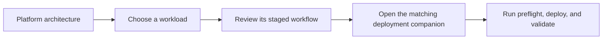

# Architecture and workflow guide

This directory provides the visual introduction to the AI Data Platform CVD.
Use it to understand the shared platform and workload data paths before
following the deployment companions in the repository root.

| Guide | What it explains |
|---|---|
| [Platform architecture](platform-architecture.md) | Cisco, VAST Data, NVIDIA, and Red Hat OpenShift component roles and deployment order |
| [Document RAG](document-rag.md) | Document ingestion, vector retrieval, reranking, and grounded generation |
| [VAST-native VSS](vast-native-vss.md) | Event-driven video segmentation, Cosmos reasoning, VASTDB search, and synthesis |
| [NVIDIA VSS 3.2.1 Search](nvidia-vss-3.2.1-search.md) | VIOS ingestion, direct visual and object indexing, search, optional Critic, and synthesis |
| [Workload comparison](workload-comparison.md) | Shared services and the important differences among the three validated data paths |

The diagrams describe the validated design without embedding site addresses,
credentials, or transient resource names. Exact versions and immutable source
locks remain in each deployment companion.
