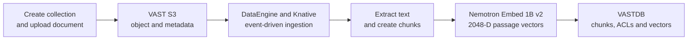
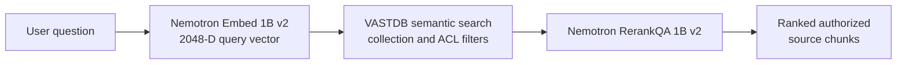
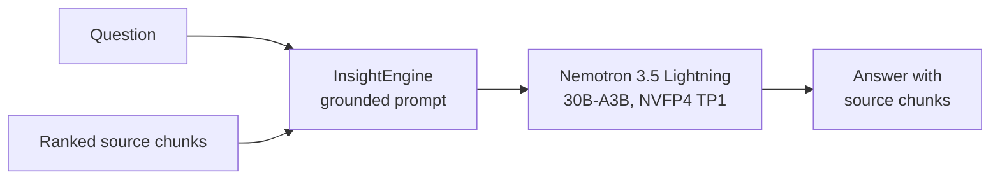

# Document RAG workflow

Document Retrieval-Augmented Generation (RAG) uses VAST InsightEngine and
DataEngine to ingest governed content, search authorized vectors, rerank the
best passages, and generate an answer grounded in the retrieved sources.
The validated document inputs are TXT and text-based PDF.

## Stage 1 — Ingest and index

## Stage 2 — Retrieve and rerank

## Stage 3 — Generate a grounded answer

| Function | Validated component |
|---|---|
| Ingestion orchestration | VAST DataEngine and Knative |
| Document and vector storage | VAST S3 and VASTDB |
| Embedding | `nvidia/llama-nemotron-embed-1b-v2`, NIM 1.13.0, 2048 dimensions |
| Reranking | `nvidia/llama-3.2-nv-rerankqa-1b-v2`, NIM 1.8.0 |
| Generation | `nvidia/nemotron-3.5-lightning-30b-a3b`, NIM 2.0.9 variant, NVFP4 TP1 |

Acceptance requires fresh document ingestion, retrieval of the expected
content, reranking, a grounded answer, and returned source chunks. Follow the
[Document RAG deployment and validation companion](../workloads/document-rag/README.md).
Changing the embedding model or vector dimension requires re-ingestion and a
new acceptance run.
