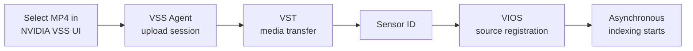
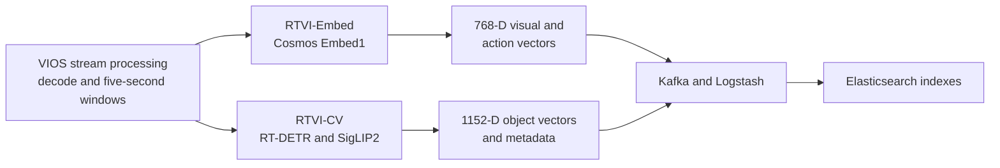
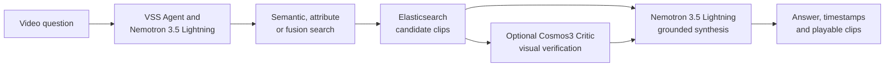

# NVIDIA VSS 3.2.1 Search workflow

The NVIDIA Video Search and Summarization (VSS) Search lane registers video
with Video IO and Storage (VIOS), creates visual/action and object indexes,
searches Elasticsearch, and can visually verify candidates before generating
an answer.

## Stage 1 — Upload and register

VST is the Video Storage Toolkit. Upload transfer chunks are not the
five-second analysis windows created during indexing.

## Stage 2 — Decode, analyze, and index

RTVI means Real-Time Video Intelligence. This lane embeds video directly; it
does not create a Cosmos Reason2 text description for every clip.

## Stage 3 — Search, verify, and answer

| Activity | Validated component | GPU request |
|---|---|---:|
| Decode and stream processing | VIOS Stream Processing | 1 |
| Video/action embedding | RTVI-Embed with `nvidia/Cosmos-Embed1-448p-anomaly-detection` | 1 |
| Detection and object embedding | RTVI-CV with RT-DETR and SigLIP2 | 1 |
| Optional visual verification | `nvidia/cosmos3-nano-reasoner`, NIM 1.7 | 1 |
| Agent planning and synthesis | `nvidia/nemotron-3.5-lightning-30b-a3b`, NIM 2.0.9 variant | 1 shared GPU |

Kafka, Logstash, and Elasticsearch are CPU services. VAST CSI supplies the
persistent volumes, while Elasticsearch remains this lane's search store. The
CVD implementation adapts NVIDIA VSS 3.2.1 Search for OpenShift; it is not an
unmodified upstream deployment. The validated input is MP4 upload; RTSP is
outside the current acceptance scope. Follow the
[NVIDIA VSS 3.2.1 deployment companion](../workloads/nvidia-vss-3.2.1-search/README.md).
