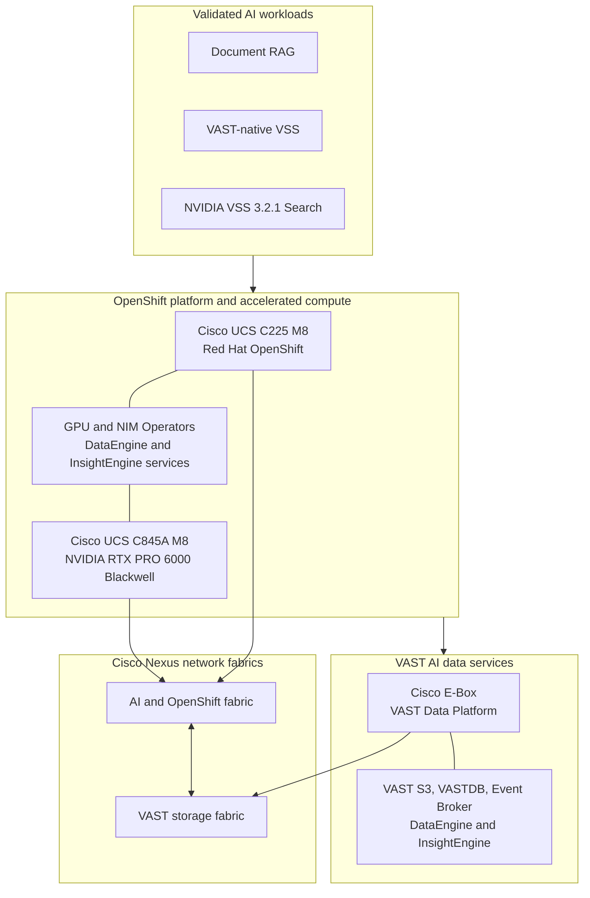
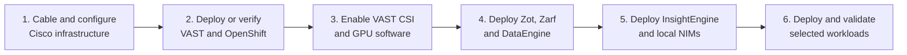

# AI Data Platform architecture

The design combines Cisco compute and networking, VAST data services, NVIDIA
accelerated AI, and Red Hat OpenShift. The infrastructure is shared, while
each workload keeps its own namespace, data path, and index.

## Solution view

| Layer | Primary role |
|---|---|
| Cisco UCS and Nexus | OpenShift control, GPU inference capacity, and high-speed workload and storage connectivity |
| Red Hat OpenShift | Container scheduling, namespace isolation, operators, Routes, and persistent-volume consumption |
| VAST Data Platform | Unified file and object storage, VASTDB, event services, DataEngine, and InsightEngine |
| NVIDIA software | GPU enablement, NIM model services, and the NVIDIA VSS Search application stack |

## Deployment order

Start with the [Nexus companion](../nexus/README.md), then use the
[DataEngine](../dataengine/README.md) and
[InsightEngine](../insightengine/README.md) companions before deploying a
workload.
