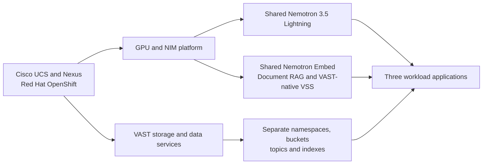

# Workload architecture comparison

All three workloads use the same Cisco, OpenShift, VAST, and NVIDIA platform,
but their ingestion and search indexes are intentionally separate.

## Three validated data paths

```mermaid
flowchart TB
    subgraph R[Document RAG]
        direction LR
        R1[Document] --> R2[Parse and chunk]
        R2 --> R3[Nemotron text embedding]
        R3 --> R4[VASTDB search]
        R4 --> R5[Rerank]
        R5 --> R6[Lightning answer]
    end

    subgraph V[VAST-native VSS]
        direction LR
        V1[Video] --> V2[Five-second clips]
        V2 --> V3[Cosmos Reason2 text]
        V3 --> V4[Nemotron text embedding]
        V4 --> V5[VASTDB search]
        V5 --> V6[Lightning answer]
    end

    subgraph N[NVIDIA VSS 3.2.1 Search]
        direction LR
        N1[Video] --> N2[VIOS processing]
        N2 --> N3[RTVI visual and object indexes]
        N3 --> N4[Kafka and Elasticsearch]
        N4 --> N5[Optional Cosmos3 Critic]
        N5 --> N6[Lightning answer]
        N4 --> N6
    end
```

| Design point | Document RAG | VAST-native VSS | NVIDIA VSS 3.2.1 Search |
|---|---|---|---|
| Primary input | TXT and text-based PDF | MP4 and approved VAST S3 batch input | MP4 upload through VST and VIOS |
| Ingestion understanding | Text parsing and chunking | Cosmos Reason2 description for each clip | Direct visual/action embedding plus object detection |
| Embedding | Nemotron Embed 1B v2, 2048-D | Nemotron Embed 1B v2, 2048-D | Cosmos Embed1, 768-D; SigLIP2 object vectors, 1152-D |
| Search store | VASTDB | VASTDB | Elasticsearch |
| Event transport | VAST Event Broker and DataEngine | VAST Event Broker and DataEngine | NVIDIA Kafka and Logstash |
| Post-retrieval refinement | Nemotron RerankQA | None | Optional Cosmos3 Critic |
| Final generation | Shared Nemotron 3.5 Lightning | Shared Nemotron 3.5 Lightning | Shared Nemotron 3.5 Lightning |

## Shared and isolated services

Sharing a model service does not merge workload authorization or indexed
data. Follow the individual workflow guide and deployment companion for each
lane.
