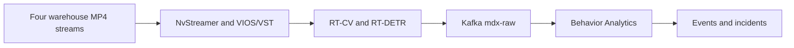
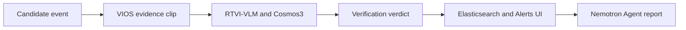
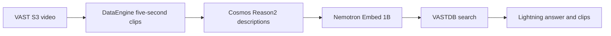
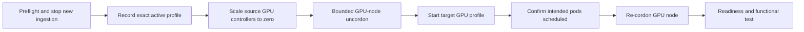

# Warehouse Operations Demo — Final Implementation Plan

Status: **implementation starter; not yet deployable**. Checkpoint 3 is in
progress and no Warehouse resources have been deployed.

Date: 2026-09-22

## Decision

Build the demonstration in two validated lanes:

1. Create a source-aligned OpenShift port of the NVIDIA VSS 3.2.1 Warehouse
   **2D Vision AI with Agents** profile as a new workload. NVIDIA publishes
   this profile for Docker Compose, so the OpenShift port requires local
   validation and must not be represented as an NVIDIA-supported Helm profile.
2. Retain the validated VAST-native VSS workflow as a complementary search and
   reasoning lane.

Use NVIDIA's native Warehouse and VIOS interfaces for the first external demo.
Do not build a custom Control Tower until both native experiences pass their
acceptance and rehearsal gates.

The configured CVD base demo remains the recovery baseline: NVIDIA VSS 3.2.1
Search and VAST-native VSS Search with their required shared NIMs. Warehouse
may use any number up to all eight GPUs. Profile switching may therefore stop
every base-demo GPU controller, but it retains releases, CPU/stateful services,
PVCs, model caches, uploaded media, VAST objects, VASTDB rows, and indexes so
the configured base mode can be restored without reinstallation or
re-ingestion.

This is a repository implementation and demonstration plan. Demo profile
switching, presenter steps, pre-indexed state, and fallback recordings stay out
of the CVD.

### Implementation checkpoint

Prepared in this repository:

- Pinned NVIDIA source, image, model, service, dependency, port, volume, and
  provisional GPU inventory.
- Immutable digest evidence for all 29 tag-based source images: 19 resolved
  from registries and 10 recovered from accepted source-environment NVIDIA
  Search runtime image IDs.
- OpenShift porting matrix and an inert-by-default Helm skeleton.
- Helm `v3.18.4` lint, inert-default render, resolved subset render,
  zero-replica RT-CV standby render, and missing-digest fail-closed checks.
- Source-locked `base-cvd` controller inventory and plan-first switching tools.
- Offline safety and failure-injection tests for blocked execution, capacity
  rejection, partial target startup, source-profile recovery, and re-cordoning.
- Dataset manifest, alert scenario matrix, evidence normalization, scoring, and
  repeatability gates.
- [Credential-safe verification procedure](../../demos/warehouse-operations/research/NGC-IMAGE-RESOLUTION.md)
  for the NGC-protected image tags. The existing NGC API key resolved Alert
  Verification, Configurator, RTVI-VLM, and Nemotron Nano; a separate Service
  Key was not required for these repositories in the validated organization.

Not yet completed:

- The derived image outputs and final Warehouse GPU-controller map.
- Complete application configuration, init Jobs, Secrets references, Routes,
  NetworkPolicies, SCC validation, and Kubernetes 1.33.9 server-side dry-run.
- Pre-switch quiescence detection, sanitized state evidence capture, a complete
  successful switch-cycle test, and exact functional acceptance commands for
  both restored base search lanes.
- Any Warehouse deployment, GPU switch, alert qualification, or live demo
  acceptance.

No OpenShift object, replica count, Secret, node scheduling state, or stored
data was changed during these checkpoints. The configured GPU node remains
cordoned.

## Scope

### In scope

- NVIDIA VSS 3.2.1 Warehouse `bp_wh` with four warehouse streams.
- Local GPU perception, local GPU VLM, and local GPU LLM.
- NVIDIA Warehouse Chat, Alerts, Dashboard, reports, VIOS playback, and
  detection overlays where the validated OpenShift media path supports them.
- Existing VAST-native VSS search, playable clips, and grounded synthesis.
- Reversible CVD-base/Warehouse GPU mode switching, including restoration of
  both NVIDIA Search and VAST-native VSS Search.
- Live OpenShift, pod, and GPU telemetry.
- Repeatable setup, reset, validation, rehearsal, and failure recovery.

### Outside the first implementation

- A unified custom Control Tower UI.
- Replacing NVIDIA Kafka or Elasticsearch with VASTDB.
- Direct VAST S3 object import into NVIDIA VIOS.
- Document RAG as a required part of the warehouse story.
- RTSP cameras outside the supplied replay data.
- 3D, MV3DT, auto-calibration, OCR, or license-plate recognition.
- Performance comparisons between NVIDIA and VAST workflows.

Document RAG may be added later as an optional procedure-grounding extension.
Observed video evidence and procedural guidance must remain visibly separate.

## Stock NVIDIA target

Use the pinned NVIDIA VSS source rather than the existing Search Helm release:

| Item | Target |
|---|---|
| Source | NVIDIA VSS tag `v3.2.1` |
| Commit | `7640d917047cf7b0fd3085eefb8282754b56bc94` |
| Mode | `MODE=2d` |
| Profile | `BP_PROFILE=bp_wh` |
| Hardware profile | `HARDWARE_PROFILE=RTXPRO6000BW` |
| Dataset | `nv-warehouse-4cams` from Warehouse App Data `3.2.0` |
| Streams | Four synchronized 1920x1080, 30-FPS videos |
| Event transport | Kafka |
| Perception | RT-CV with `nvidia/tao/rtdetr_2d_warehouse:deployable_rn50_v1.0.2` |
| Behavior | ROI occupancy, tripwires, proximity, restricted-area, and confined-area incidents |
| VLM | `ngc:nim/nvidia/cosmos3-nano-reasoner:bf16-final` through RTVI-VLM |
| Agent LLM | `nvcr.io/nim/nvidia/nvidia-nemotron-nano-9b-v2:1` |
| Analytics store | Elasticsearch with Kibana dashboards |
| State services | PostgreSQL, Redis, VIOS/VST storage, and agent object storage |
| UI | Global Chat, Alerts, and Dashboard |

The Warehouse profile is not the Search developer profile. It does not expose
the Search or Video Management tabs and does not create the Cosmos Embed and
SigLIP vector indexes used by the existing NVIDIA Search profile.

NVIDIA publishes Warehouse `bp_wh` primarily as a Docker Compose industry
profile. The v3.2.1 Helm charts cover Base, Alerts, Search, and LVS developer
profiles, not the integrated Warehouse profile. The OpenShift deployment is
therefore a separately validated adaptation.

The v3.2.1 source lock intentionally contains a mix of `3.2.0` and `3.2.1`
service image tags; preserve the versions defined by the pinned source instead
of mechanically changing every image to `3.2.1`. In the stock profile,
`VLM_MODE=none` is expected because Cosmos3 is hosted inside RTVI-VLM; it does
not mean that VLM verification is disabled.

The complete inventory also includes Alert Verification/Bridge, Logstash,
Blueprint Configurator, SDR controller, Kafka topic and calibration
initialization, and the Agent's object store. The OpenShift render must account
for each of these components and dependencies.

## Demonstration story

1. Open the NVIDIA VIOS/VST four-camera view.
2. Replay the four NVIDIA warehouse camera videos.
3. Show RT-DETR detecting and tracking visible workers, forklifts, pallets, or
   boxes.
4. Show Behavior Analytics creating a calibrated event or candidate incident.
5. Open the event in the NVIDIA Warehouse Alerts view.
6. Show Cosmos3 returning `confirmed`, `rejected`, or `unverified` for the
   candidate evidence.
7. Select **Generate Report** and let the Warehouse Agent retrieve the related
   camera, snapshot, and video evidence.
8. Open the VAST-native UI and search the same warehouse source family by
   visible activity.
9. Show VAST DataEngine segmentation, Cosmos Reason2 descriptions, 2048-D
   Nemotron embeddings, VASTDB retrieval, playable clips, and Lightning
   synthesis.
10. End with OpenShift and GPU telemetry identifying the active services.

The two lanes demonstrate complementary capabilities. They are not presented
as a benchmark or as interchangeable implementations.

## Architecture

### Stage 1 — NVIDIA real-time perception and events



### Stage 2 — NVIDIA verification and agent workflow



The VSS Agent invokes the Video Analytics and VST MCP interfaces to list
sensors, query events, retrieve snapshots or clips, and generate a report.

### Stage 3 — VAST-native semantic evidence lane



## OpenShift isolation

| Area | Existing NVIDIA Search | New NVIDIA Warehouse | VAST-native VSS |
|---|---|---|---|
| Namespace | `nvidia-vss-321-search` | `nvidia-vss-321-warehouse` | `vast-vss` |
| Helm release | Existing `nvidia-vss-search` release recorded in `profiles.yaml` | `nvidia-vss-warehouse` | Existing `vast-vss` release recorded in `profiles.yaml` |
| Video plane | VIOS/VST Search instance | Separate VIOS/VST Warehouse instance | VAST S3 |
| Event/search state | Kafka and Elasticsearch | Separate Kafka, Redis, PostgreSQL, and Elasticsearch | VAST Event Broker and VASTDB |
| Persistent data | Existing retained PVCs | New Warehouse-specific VAST CSI PVCs | Existing VAST storage |
| CPU placement | `net-type=fi-attached` | `net-type=fi-attached` | Existing placement |
| GPU placement | `net-type=c845-cx7` | `net-type=c845-cx7` | Existing placement |

Use distinct Service names, Routes, Secrets, ConfigMaps, PVCs, Kafka topics,
and Elasticsearch indices. Do not share mutable state between the two NVIDIA
profiles.

The OpenShift adaptation must:

- Convert the NVIDIA Compose services and dependencies into reviewed OpenShift
  resources and one pinned Helm release.
- Replace host networking and `localhost` dependencies with Kubernetes Service
  DNS.
- Replace host ports and HAProxy exposure with OpenShift Routes only where a
  browser or approved external client needs access.
- Use the target environment's validated VAST CSI StorageClass for
  Warehouse-specific PVCs only after validating access mode, latency, locking
  behavior, and capacity for PostgreSQL, Kafka, Elasticsearch, VIOS, and the
  Agent object store. The source environment used `vastdata-filesystem`; this
  is a site design choice, not an NVIDIA requirement.
- Map Compose health checks and startup dependencies to readiness, liveness,
  startup probes, and bounded init logic.
- Create narrowly scoped ServiceAccounts and SCC bindings based on the final
  render.
- Pin every image, model, and source revision; never use `latest`.
- Preserve NVIDIA Kafka and Elasticsearch in the first implementation.

The source environment runs Kubernetes 1.33.9. NVIDIA's v3.2.1 Helm guide
requires Kubernetes 1.34 or later for the developer profiles, and it does not
cover the Warehouse industry profile. Server-side admission, runtime behavior,
persistence, and functional acceptance must therefore be demonstrated rather
than inferred.
NVIDIA OpenShift PR 1248 remains open and covers developer profiles rather than
Warehouse; it does not supply a supported Warehouse/OpenShift path. Routes must
also be tested for WebSocket behavior, upload size, response timeout, and video
playback.

## GPU operating modes

The example base profile consumes all eight GPUs:

| Base GPU consumer | Controller | GPUs |
|---|---|---:|
| Shared embedding | `nims/NIMService/embedding` | 1 |
| Document RAG reranker | `nims/NIMService/reranker` | 1 |
| Shared Lightning generation | `nims/NIMService/llm-nemotron-35-lightning` | 1 |
| VAST-native Cosmos Reason2 | `nims/NIMService/vss-cosmos-reason2-8b-170` | 1 |
| NVIDIA Search perception | `nvidia-vss-321-search/StatefulSet/vss-rtvi-cv` | 1 |
| NVIDIA Search embedding | `nvidia-vss-321-search/Deployment/vss-rtvi-embed` | 1 |
| NVIDIA Search stream processing | `nvidia-vss-321-search/StatefulSet/vss-vios-streamprocessing` | 1 |
| NVIDIA Search Cosmos3 Critic | `nvidia-vss-321-search/NIMService/nvidia-cosmos3-reasoner` | 1 |

Use NVIDIA's default local Warehouse Compose topology as the minimum functional
reference for the first render. The site policy permits Warehouse to use any
accepted allocation from one through all eight GPUs. The stock topology is
expected to require at least three; the final OpenShift render fixes the actual
count:

| Active mode | Shared RAG/VAST services | NVIDIA Search | NVIDIA Warehouse | Total |
|---|---:|---:|---:|---:|
| `base-cvd` | 4 | 4 | 0 | 8 |
| `warehouse` | 0 | 0 | Exact accepted allocation within 1–8; stock topology currently implies at least 3 | 1–8 policy range |

The NVIDIA Compose target assigns three GPUs to:

1. RT-CV perception.
2. Cosmos3 RTVI-VLM.
3. Local Nemotron Nano 9B agent LLM.

No required inference will be moved to CPU. Kafka, Redis, PostgreSQL,
Elasticsearch, Behavior Analytics, APIs, MCP services, and browser UI remain
CPU workloads where NVIDIA defines them as CPU services.

The policy range does not mean that the provisional chart already implements
every count. It currently represents five candidate GPU controllers; the final
render may consolidate, remove, or add replicas/controllers while remaining
within the eight-GPU ceiling. The three-GPU number is not yet an accepted
OpenShift allocation. Stock Compose
assigns GPU 0 to both NvStreamer and RT-CV, and VIOS stream processing also uses
the NVIDIA runtime. Separate OpenShift pods requesting exclusive
`nvidia.com/gpu` resources could exceed three GPUs. It is acceptable for the
Warehouse mode to consume four, five, or up to eight GPUs if that is required
for a faithful, stable translation. Before deployment, the
render audit must map every Compose GPU device assignment to an OpenShift
controller. Where NVIDIA expects containers to share one GPU, use a reviewed
multi-container Pod design or stop for redesign; do not introduce time slicing,
MIG, or MPS as an undocumented shortcut.

The first accepted configuration uses the NVIDIA default models. Reusing the
existing Cosmos3 or Lightning endpoints is an optional later optimization and
must be recorded as a site integration deviation, not the reference baseline.

## Reversible GPU profile switch

The required invariant is recoverability, not simultaneous operation. The
`base-cvd` profile is the source of truth for the existing demonstration. A
Warehouse switch may scale all eight base GPU controllers to zero, while their
CPU services and persistent state remain intact. Returning to `base-cvd` must
restore NVIDIA Search, VAST-native VSS Search, embedding, reranking, Lightning,
and Cosmos Reason2 to their recorded replicas and pass their existing tests.



The mode tool will default to plan-only operation:

```text
set-demo-mode.sh base-cvd
set-demo-mode.sh warehouse
set-demo-mode.sh base-cvd --execute --ack <approval-token>
set-demo-mode.sh warehouse --execute --ack <approval-token>
```

Execution must require a separate acknowledgement because it changes replica
counts and temporarily changes node scheduling.

### Base controllers to stop for Warehouse mode

The four NVIDIA Search controllers are:

```bash
oc -n nvidia-vss-321-search patch \
  nimservice/nvidia-cosmos3-reasoner \
  --type=merge -p '{"spec":{"replicas":0}}'

oc -n nvidia-vss-321-search scale \
  deployment/vss-rtvi-embed \
  --replicas=0

oc -n nvidia-vss-321-search scale \
  statefulset/vss-rtvi-cv \
  statefulset/vss-vios-streamprocessing \
  --replicas=0
```

The four shared base controllers are `NIMService/embedding`,
`NIMService/reranker`, `NIMService/llm-nemotron-35-lightning`, and
`NIMService/vss-cosmos-reason2-8b-170` in `nims`. The NIMService is the
controller for each NIM; do not scale its generated Deployment directly.
Restoring `base-cvd` sets all eight controlling resources to their recorded
replicas and validates both search lanes.

The exact Warehouse GPU controller names will come from the final rendered
manifest. The mode tool must refuse execution until those names and their GPU
requests are source-locked.

Search and VAST-native CPU/stateful services and their bound PVCs may remain
running while Warehouse mode is active, subject to final CPU and memory
admission. This preserves media and indexes and shortens restoration time.
Neither base search lane may be presented as operational while its required GPU
controllers are stopped.

### Switch preflight

The script must:

1. Verify `oc whoami`, API server, and current context.
2. Verify the GPU node recorded in `profiles.yaml` is Ready and cordoned.
3. Identify an exact recognized replica signature for the active mode.
4. Reject unexpected or Pending GPU pods.
5. Verify GPU Operator readiness and eight allocatable GPUs.
6. Verify all retained PVCs are Bound.
7. Verify that no upload, indexing, or replay reset is in progress.
8. Record Helm histories, pod restart counts, PVC UIDs, and controller replicas.
9. Calculate total target GPU requests and reject a value above eight.
10. Before leaving `base-cvd`, verify NVIDIA Search, VAST-native VSS Search,
    Document RAG, and the four shared NIMs; record their exact controller state.

Use a trap-protected scheduling window only after a separately reviewed and
approved execution plan:

```bash
GPU_NODE=replace-with-gpu-node
recorder() { oc adm cordon "$GPU_NODE" >/dev/null; }
trap recorder EXIT INT TERM

oc adm uncordon "$GPU_NODE"
# Start only the approved target GPU controllers.
# Wait for the intended GPU pods to report PodScheduled=True on "$GPU_NODE".
oc adm cordon "$GPU_NODE"

trap - EXIT INT TERM
```

Re-cordon as soon as the intended pods are assigned. Model initialization can
continue while the node is cordoned.

### Switch recovery

If the target fails:

1. Scale the target GPU controllers to zero.
2. Confirm their GPU pods have terminated.
3. Reopen the bounded scheduling window.
4. Restore the exact previously active source profile. If that state cannot be
   identified, stop and prepare a separately reviewed `base-cvd` recovery.
5. Re-cordon immediately after scheduling.
6. Wait for readiness and run the existing smoke test.
7. Preserve pod descriptions and sanitized logs.

Do not use a Helm rollback for an ordinary mode switch. Never delete a PVC,
StatefulSet, namespace, NIM cache, uploaded video, Elasticsearch index, VAST S3
object, or VASTDB row during switching or recovery.

Planning targets, to be replaced by measurements:

- Warm `base-cvd` restore: 10–20 minutes.
- Warm Warehouse restore: 10–20 minutes.
- First Warehouse deployment or cold model initialization: 30–60 minutes.
- Configured GPU node uncordoned: less than two minutes per controlled switch.

The current switch implementation proves controller-level recovery only in
offline failure-injection tests. Acceptance requires three complete
`base-cvd` → `warehouse` → `base-cvd`
cycles, including functional tests of both restored search lanes, and records
median and worst-case readiness time.

## User experience

Use four prepared browser tabs for the first demo:

| Tab | Purpose |
|---|---|
| NVIDIA VIOS/VST | Four-camera view and perception overlays |
| NVIDIA Warehouse UI | Global Chat, Alerts, Dashboard, and report generation |
| VAST-native VSS | Semantic search, playable evidence, and synthesis |
| Platform telemetry | Eight GPUs, service assignment, utilization, memory, and pod health |

Do not use the Insight Engine Lab UI for video. Its backend-for-frontend pattern
may be reused later, but its document-oriented interface is not the Warehouse
experience.

Suggested NVIDIA Warehouse prompts:

```text
List the warehouse sensors and their current status.
```

```text
Show the latest confirmed proximity event involving a worker and forklift.
Include the camera, timestamp, verification status, and supporting video.
```

```text
Generate a report for the selected alert using only the available event and
video evidence.
```

```text
Fetch the video and a snapshot for Camera_01 around the reported event.
```

Suggested VAST-native prompts:

```text
Find clips showing a forklift operating near a worker wearing a yellow safety
vest.
```

```text
Show pallet or box movement and identify the camera and clip time.
```

```text
Summarize visible warehouse activity across the retrieved clips. Do not infer
cargo contents, intent, incident cause, or a safety violation.
```

The final event and prompts must be matched to activity independently verified
in the selected footage. The proximity example is conditional until the sample
and configured analytics produce it reliably. Do not script an event that the
data does not produce.

## Data and evidence

Do not commit NVIDIA videos or derived clips. Commit only acquisition
instructions and an evidence manifest containing:

- Dataset name and version.
- Source filename, byte size, and SHA-256 checksum.
- NVIDIA sensor ID and corresponding VAST camera ID.
- Source and clip timestamps.
- Processing lane.
- Search, event, or incident identifier.
- Score when the API provides one.
- Verification status.
- Model and profile version.
- Demo run ID.

Do not record credentials, bearer tokens, raw sensitive logs, private
certificates, vectors, or Secret data.

Use of NVIDIA Warehouse App Data is subject to the license attached to the NGC
resource. Confirm that license covers the intended public presentation. If it
does not, substitute Cisco-owned or separately licensed synchronized footage:
equal-duration cameras, at least 60 seconds, 1920x1080 at 30 FPS, no B-frames,
and enough visible moving people to exercise the selected analytics.

## Repository layout

```text
demos/warehouse-operations/
├── README.md
├── profiles.example.yaml
├── data/
│   ├── warehouse-data-manifest.yaml
│   └── ALERT-SCENARIO-MATRIX.md
├── openshift/
│   └── nvidia-warehouse/
│       ├── source-lock.yaml
│       └── chart/
│           ├── Chart.yaml
│           ├── values.yaml
│           └── templates/
├── research/
│   ├── NVIDIA-SOURCE-INVENTORY.md
│   └── OPENSHIFT-PORTING-MATRIX.md
├── scripts/
│   ├── show-status.sh
│   ├── set-demo-mode.sh
│   └── warehouse_alert_scoring.py
├── runbooks/
│   ├── PROFILE-SWITCHING.md
│   └── ALERT-SCORING.md
└── tests/
    └── test_warehouse_alert_scoring.py

apps/warehouse-control-tower/       # Optional later phase
```

Repository content must be site-neutral where practical, use placeholders for
site-specific endpoints, and contain no authoring-tool references or secrets.

## Implementation milestones

| Milestone | Deliverable | Pass gate | Estimate |
|---|---|---|---:|
| 0. Freeze story | Dataset, camera map, known visible activities, claims, prompts, and publication permission | Reviewed story and evidence matrix | 0.5–1 day |
| 1. Lock NVIDIA inputs | Pinned source, image/model inventory, Compose dependency/GPU/volume map, entitlement check | Every artifact has a version or digest; no `latest` | 1–2 days |
| 2. Build OpenShift render | Separate namespace, Helm chart, Services, probes, PVCs, SCCs, Routes, selectors, and NetworkPolicy | Helm lint, client render audit, Kubernetes 1.33.9 server dry-run | 2–3 days |
| 3. Validate capacity | Storage/quota matrix, CPU/memory requests, exact GPU-controller map, and switching plan | Render requests no more than eight GPUs and all PVC sizes are approved | 0.5–1 day |
| 4. Deploy state and CPU plane | Warehouse storage, Kafka, Redis, PostgreSQL, Elasticsearch, VIOS, APIs, MCP, Agent, and UI | Stateful services retain data across a controlled restart | 1–2 days |
| 5. Deploy GPU plane | RT-CV, local Cosmos3 VLM, and local Nemotron Nano 9B | Exact model IDs, three-GPU target or reviewed revised mapping, no unexpected pods | 1–2 days |
| 6. Validate NVIDIA flow | Four streams, detections, behavior records, event, VLM verdict, report, UI, playback | NVIDIA acceptance matrix passes | 1–2 days |
| 7. Align VAST lane | Stable source-family mapping, VAST prompts, and retained validated search | VAST search and non-empty grounded synthesis pass | 1 day |
| 8. Automate demo operations | Plan-first switching, status, preflight, reset, telemetry, and recovery | Three complete mode-switch cycles pass without data deletion | 1–2 days |
| 9. Rehearse and package | Operator run card, talk track, screenshots, sanitized evidence, and fallback recording | Five consecutive warm demos and one fallback rehearsal pass | 2–3 days |

Expected duration:

- Native NVIDIA Warehouse plus VAST-native demonstration: **9–14 working
  days**.
- Optional unified Control Tower: **5–8 additional working days**.
- GTC-quality implementation including the optional UI: **14–22 working days
  total**.

The largest uncertainty is the Compose-to-OpenShift conversion, especially GPU
co-location, SCC requirements, startup ordering, shared memory, persistent
volumes, and service addressing.

## Acceptance matrix

| Area | Pass condition |
|---|---|
| Dataset | Four sources match the recorded names, sizes, checksums, duration, resolution, and camera mapping |
| NVIDIA video | Four sources are healthy and playable in VIOS at 1080p30 |
| Perception | RT-CV publishes tracked detections to `mdx-raw` without GPU errors or restarts |
| Behavior | ROI, tripwire, or other configured behavior records appear in the expected Kafka topics |
| Analytics | Elasticsearch and Kibana show the camera and event data |
| Verifiable incident | An incident type supported by Alert Verification produces playable VIOS evidence and an Alerts UI record |
| VLM | Cosmos3 returns and stores a clear `confirmed`, `rejected`, or `unverified` verdict for that supported incident |
| Agent | Chat lists sensors, retrieves a snapshot or clip, queries events, and generates a grounded report |
| Warehouse UI | Chat, Alerts, and Dashboard work; Search and Video Management are absent as expected |
| VAST ingestion | Expected camera and segment counts are complete |
| VAST retrieval | Search returns relevant, playable, timestamped clips |
| VAST synthesis | Lightning returns a non-empty answer grounded only in retrieved evidence |
| Telemetry | Live pod readiness and DCGM measurements match the active services and distinguish reserved memory from utilization |
| Switching | Warehouse starts with its accepted GPU allocation, and `base-cvd` restores both NVIDIA Search and VAST-native VSS Search from retained state without reinstallation, re-ingestion, or deletion |
| Stability | No unexpected Pending pods, new restarts, DiskPressure, or unresolved Warning events |
| Rehearsal | Five consecutive 8–10 minute demos complete without CLI recovery |
| Fallback | A recorded walkthrough, screenshots, and sanitized result evidence are available locally |

## Risks and stop conditions

Stop before cluster deployment if any of these remain unresolved:

1. The pinned Warehouse images or models are inaccessible.
2. The Compose GPU-sharing map cannot fit safely without time slicing.
3. The rendered target exceeds eight GPUs.
4. Required PVC capacity or VAST quota is unavailable.
5. Kubernetes 1.33.9 server-side admission fails.
6. A required container cannot run under a reviewed OpenShift SCC.
7. Service-to-service addressing still depends on host networking or
   unresolved `localhost` assumptions.
8. The NVIDIA sample-data license is not approved for the intended public
   presentation.
9. The selected footage does not generate the event claimed in the story.
10. The complete `base-cvd` mode—NVIDIA Search, VAST-native VSS Search, and
    their required shared NIMs—cannot be restored from retained state.
11. The target NVIDIA driver fails Warehouse runtime validation. The source
    environment used driver `595.91.07`; its difference from NVIDIA's
    published 580-series validation environment is a required test condition,
    not evidence by itself that either driver is unsupported.

## Next implementation checkpoint

The next checkpoint remains render-only:

1. Build and resolve all locally derived image outputs to immutable digests.
2. Complete the missing configuration, initialization Jobs, probes, storage,
   Service, Route, NetworkPolicy, and approved Secret references.
3. Run `helm lint` and render the full namespace locally.
4. Audit every rendered `nvidia.com/gpu` request and replace all Warehouse
   controller placeholders in `profiles.yaml`.
5. Run static safety checks and an OpenShift 4.20/Kubernetes 1.33.9
   server-side dry-run.
6. Present the exact manifests, commands, expected effects, and rollback for
   approval before any deployment or GPU scheduling change.

## Official references

- [NVIDIA VSS v3.2.1 repository](https://github.com/NVIDIA-AI-Blueprints/video-search-and-summarization/tree/v3.2.1)
- [NVIDIA Warehouse Quickstart](https://docs.nvidia.com/vss/3.2.1/warehouse-docs/Quickstart-Guide.html)
- [NVIDIA 2D Vision AI with Agents Profile](https://docs.nvidia.com/vss/3.2.1/warehouse-docs/2D-profile-with-agents.html)
- [NVIDIA Warehouse Reference Agentic UI](https://docs.nvidia.com/vss/3.2.1/warehouse-docs/vss-warehouse-ui.html)
- [NVIDIA VSS Helm deployment guide](https://docs.nvidia.com/vss/3.2.1/helm-deployment.html)
- [NVIDIA Warehouse App Data 3.2.0](https://catalog.ngc.nvidia.com/orgs/nvidia/vss-warehouse/resources/vss-warehouse-app-data/-/version-history)
