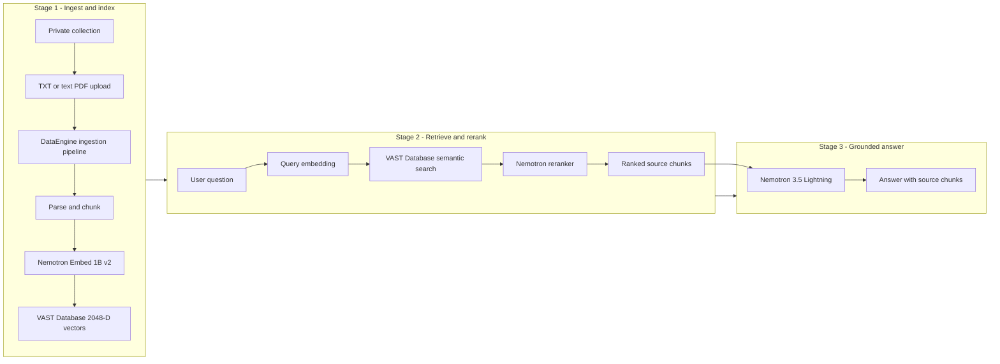

# Document RAG — CVD companion files

This directory contains the customer-facing acceptance and rollback companion
for the **Deploy Document RAG** CVD section. The platform is deployed by the
[`VAST InsightEngine companion`](../../insightengine/); this workload companion
verifies the installed data path and runs the repeatable Document RAG tests.

Review the [visual workflow guide](../../docs/document-rag.md) before running
this companion.

It contains no credentials, model artifacts, application data, or duplicate
Helm values. The validation scripts run inside the existing InsightEngine
backend pod and read the runtime identity from its mounted configuration. No
password, bearer token, or Kubernetes Secret value is copied to the client or
printed by the wrappers.

## Validated workflow



## Directory contents

```text
document-rag/
├── .gitignore
├── README.md
├── release-inputs.example.env
├── source-lock.yaml
└── scripts/
    ├── lib.sh
    ├── preflight.sh
    ├── validate.sh
    └── rollback.sh
```

`source-lock.yaml` pins the InsightEngine release and the checksums of the
reviewed validators under the repository's top-level `scripts/` directory.
Deployment and acceptance therefore use the exact implementation shipped with
the selected repository tag.

## Prerequisites

- VAST DataEngine, Knative, VAST CSI, and InsightEngine are deployed and
  verified with the release-matched platform companions.
- The application namespace and registry assignment have been saved in the
  VAST management interface.
- The embedding, reranking, and generation NIM Services are Ready.
- The operator has `oc`, `helm`, Python 3, `awk`, `grep`, and `sha256sum`.
- The backend pod has its normal runtime configuration mounted. Do not create a
  second credential file for these tests.

## 1. Prepare the local inputs

Run from this directory:

```bash
cd AI-Data-Platform-CVD/workloads/document-rag
cp release-inputs.example.env release-inputs.env
${EDITOR:-vi} release-inputs.env
```

Replace every placeholder. `CVD_INSIGHTENGINE_ENV_FILE` points to the private
input file already used by `insightengine/scripts/verify.sh`; it
does not contain the application password. The completed workload input file
is ignored by Git and must contain only the non-secret values shown in the
example.

## 2. Run the read-only preflight

```bash
./scripts/preflight.sh --env release-inputs.env
```

The command verifies the exact OpenShift API, context, and identity before any
other action. It then runs the InsightEngine deployment verifier, checks the
locked validator checksums, and confirms that the backend, ingestion pipeline,
Knative path, and three local NIM Services are Ready. It does not create or
change a cluster resource.

## 3. Run acceptance

Run the complete sequence:

```bash
./scripts/validate.sh --env release-inputs.env --stage all
```

Or run each stage separately:

```bash
./scripts/validate.sh --env release-inputs.env --stage models
./scripts/validate.sh --env release-inputs.env --stage functional
./scripts/validate.sh --env release-inputs.env --stage embedding
```

The stages prove:

| Stage | Acceptance scope |
| --- | --- |
| `models` | Model discovery plus one bounded embedding, reranking, and generation request |
| `functional` | Private TXT and PDF ingestion, multi-document retrieval, reranking, source attribution, grounded answers, collection isolation, and invalid-token rejection |
| `embedding` | Repeated query and passage embeddings through the stable Service, with 2048 dimensions and zero failures |

The functional stage creates uniquely named synthetic collections, documents,
and conversations and retains them as acceptance evidence. It does not upload
customer data. Cleanup is a separate data-management change and is not
automated by this companion.

Pass requires every requested stage to end with `PASS`. Record the repository
revision, validation run ID, collection names, model IDs, vector dimension,
source counts, elapsed times, and final summaries with the deployment evidence.

## 4. Preview or apply an application rollback

List and preview a previously recorded known-good backend revision:

```bash
./scripts/rollback.sh \
  --env release-inputs.env \
  --revision <known-good-revision>
```

After the target revision and command are reviewed and approved:

```bash
./scripts/rollback.sh \
  --env release-inputs.env \
  --revision <known-good-revision> \
  --apply
```

The rollback changes only the InsightEngine backend Helm release. It retains
PVCs, collections, documents, conversations, VAST resources, NIM caches, and
model services. Validate the endpoint configuration represented by the target
revision before selecting it; a revision number from another deployment is not
portable.

## Release boundary

This companion is locked to InsightEngine 5.4.3 and the model profile recorded
in `release-inputs.example.env`. A different release, model, endpoint layout,
or embedding dimension requires an updated source lock and a new acceptance
run. Do not bypass a checksum or context failure.
