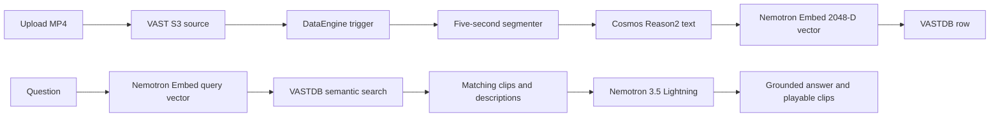

# VAST-native VSS — CVD companion files

This directory supports the **Deploy VAST-native VSS** CVD section. It deploys
the validated VAST DataEngine VSS Foundation Stack on Red Hat OpenShift. It is
separate from the NVIDIA VSS 3.2.1 Search profile.

Review the [visual workflow guide](../../docs/vast-native-vss.md) before using
this deployment companion.

The companion is site-neutral. It contains no credentials, private endpoints,
node names, or kubeconfigs. All mutation wrappers are preview-only unless the
operator supplies `--apply` after reviewing the rendered artifacts.

## Validated workflow



The function pods are CPU orchestrators. Local NVIDIA NIM services reserve one
GPU each for Cosmos Reason2, Nemotron Embed, and Nemotron 3.5 Lightning. The
base path does not use the Document RAG reranker or the NVIDIA Cosmos3 Critic.

## Directory contents

```text
vast-native-vss/
├── .gitignore
├── README.md
├── release-inputs.example.env
├── source-lock.yaml
├── source-assets/
│   ├── patches/
│   └── locks/
├── manifests/
│   ├── namespace.yaml.tpl
│   ├── storage-resources.yaml.tpl
│   ├── kafka-topic.yaml.tpl
│   └── pipeline.yaml.tpl
├── values/
│   └── site-values.example.yaml
└── scripts/
    ├── lib.sh
    ├── preflight.sh
    ├── prepare-source.sh
    ├── build-and-publish.sh
    ├── render.sh
    ├── register-dataengine.sh
    ├── deploy.sh
    ├── verify.sh
    └── rollback.sh
```

The CVD repository also carries the OpenShift application chart and reviewed
source patch set. The source repository itself is obtained directly from
VAST; it is not copied into the CVD repository.

## 1. Prepare the site inputs

```bash
git clone https://github.com/ucs-compute-solutions/AI-Data-Platform-CVD.git \
  AI-Data-Platform-CVD
cd AI-Data-Platform-CVD/workloads/vast-native-vss
cp release-inputs.example.env release-inputs.env
${EDITOR:-vi} release-inputs.env
```

Keep the private build and render directories outside the Git checkout. Leave
the backend and frontend digest placeholders unchanged until Step 3;
source preparation and image publication do not consume them. Rendering and
deployment require the published `sha256` values.

Leave both CPU node-selector inputs empty when the site does not use a
dedicated CPU placement label; otherwise set both values.

Use managed DNS and trusted certificates. Do not reproduce a test-only host
alias or disable TLS verification. Create the runtime and image-pull Secrets
through the approved secret-management workflow; verify names and keys without
displaying values.

The runtime Secret must contain `config.yaml` and the trusted VMS CA bundle.
Its configuration supplies the VAST S3 and VASTDB endpoints and credentials,
VMS tenant and authentication fields, application JWT key, upload-bucket names,
embedding endpoint and model, and Lightning endpoint and model. Keep
`embedding_dimensions: 2048` and `llm_enable_thinking: false` for the validated
profile.

The private DataEngine pipeline Secret file follows the VAST blueprint
[`deployments/dataengine-vss-ingest-pipeline/vss-cli-secret-file-template.yaml`](https://github.com/vast-data/vss-blueprint/blob/8b34c2c919edcec6b7bd51cf9ff09722d3dda879/deployments/dataengine-vss-ingest-pipeline/vss-cli-secret-file-template.yaml).
It supplies the same S3, model, and VASTDB settings plus
`segment_duration: 5`. Store it outside Git, restrict its file permissions,
and pass its path only to `deploy.sh`.

## 2. Obtain and prepare the pinned source

```bash
git clone https://github.com/vast-data/vss-blueprint.git \
  <vast-vss-source-directory>
git -C <vast-vss-source-directory> fetch --depth 1 origin \
  8b34c2c919edcec6b7bd51cf9ff09722d3dda879
git -C <vast-vss-source-directory> checkout --detach \
  FETCH_HEAD
git -C <vast-vss-source-directory> status --porcelain --untracked-files=all

./scripts/preflight.sh --env release-inputs.env
./scripts/prepare-source.sh --env release-inputs.env
```

The checkout must remain clean. `prepare-source.sh` makes a disposable build
context, applies the reviewed OpenShift, optional-source-service, and Lightning
thinking-control patches, installs the checksum-verified dependency locks, and
rejects TLS bypasses or unpinned base images.

The site-neutral patch and dependency-lock inputs are carried under
`source-assets/`; `source-lock.yaml` binds the source revision and patch
checksums. The validated VAST builder requested a Python version that was
unavailable in the selected release environment. Confirm a corrected VAST
builder or a formal vendor-approved alternative before publishing customer
images.

## 3. Build and publish immutable images

Preview the six image references first:

```bash
./scripts/build-and-publish.sh --env release-inputs.env
```

After the source, builder, registry, and change are approved:

```bash
./scripts/build-and-publish.sh --env release-inputs.env --apply
```

The wrapper builds the backend, frontend, and four DataEngine functions. It
refuses `latest`, verifies that each target tag is absent, pushes the explicit
tag, and prints the registry digest for each image. Authentication, TLS, or
registry lookup errors stop the run instead of being treated as an unused tag.
Use registry-side tag immutability where available to close the concurrent-push
race. Copy the two application digests into `release-inputs.env` before
rendering. Retain the four function-image digests as deployment evidence.

## 4. Create the namespace and complete VAST assignments

Render once to produce the namespace manifest:

```bash
./scripts/render.sh --env release-inputs.env
oc apply -f <private-render-directory>/namespace.yaml
```

In the VAST management UI:

1. Add the new OpenShift namespace to the existing DataEngine compute cluster.
2. Save the namespace assignment.
3. Open the existing Zot registry assignment and save it again so the new
   namespace is included.
4. Verify that the registry record uses the correct URL and credential record.

Create the namespace-local Zot pull Secret and VSS runtime Secret through the
approved secret workflow. Do not place their values in the environment file.
Rerun `render.sh`; with the namespace present it performs server-side
validation of the application manifest.

## 5. Register functions and S3 triggers

The wrapper implements the CLI path documented by the pinned VAST blueprint.
It is intentionally limited to a clean installation and refuses to overwrite
an existing function or trigger.

```bash
./scripts/register-dataengine.sh --env release-inputs.env
# Review the exact registry, image tag, buckets, broker, and topic.
./scripts/register-dataengine.sh --env release-inputs.env --apply
```

This creates:

- `video-segmenter`, `video-reasoner`, `video-embedder`, and
  `video-vastdb-writer`;
- `video-chunk-land-trigger` for `ObjectCreated:*` on `video-chunks`; and
- `video-segment-land-trigger` for `ObjectCreated:*` on
  `video-chunks-segments`.

The DataEngine UI is an equivalent supported path when a release-specific CLI
is not available. Use the same names, image tag, buckets, Event Broker topic,
and graph shown in the rendered pipeline.

## 6. Deploy the application, VAST resources, and pipeline

Review all files and their SHA-256 receipt under the private render directory.
`render.sh` also packages the exact Helm chart used for deployment and prints
the receipt digest. The receipt also binds the SHA-256 of the private site-input
file without copying its contents. Record that digest with the change approval.
Then preview the apply order:

```bash
./scripts/deploy.sh \
  --env release-inputs.env \
  --pipeline-secret-file <private-vss-cli-secret-file>
```

The preview verifies every reviewed file again and prints the same receipt
digest. It does not rerender the chart.

After approval:

```bash
./scripts/deploy.sh \
  --env release-inputs.env \
  --pipeline-secret-file <private-vss-cli-secret-file> \
  --receipt-sha256 <approved-receipt-sha256> \
  --apply
```

The writer creates `processed-videos-schema.processed-videos-collection` on the
first event with a 2048-dimensional vector column. Do not pre-create the schema
or table manually.

## 7. Verify and run functional acceptance

```bash
./scripts/verify.sh --env release-inputs.env
```

Pass requires:

- the Helm application and Route are healthy;
- four Knative function Services are Ready;
- both S3 triggers and the DataEngine pipeline are present;
- three S3 views, one VASTDB view, and the Event Broker topic are Ready;
- Cosmos Reason2, Nemotron Embed, and Lightning NIM Services are Ready; and
- Warning events recorded during the deployment or acceptance window have been
  reviewed and no unresolved workload fault remains.

`verify.sh` deliberately stops when Warning events are present so they cannot be
missed. A retained historical or transient event is not a clean-event result;
record its timestamp and reason, confirm that the affected resource recovered,
and retain the successful functional test with the acceptance evidence.

Complete acceptance in the UI with a new MP4 and a unique filename:

1. Upload the MP4 with a unique camera ID, tags, deliberate access scope, and a
   custom prompt that asks only about activity that is actually visible. Do not
   put an expected answer or calibration marker in the prompt.
2. Confirm the expected number of five-second clips is indexed.
3. Confirm every returned row has non-empty Cosmos Reason2 text and a
   2048-dimensional vector.
4. Run a semantic query that returns the new source and play a matching clip.
5. Enable LLM synthesis and require a non-empty answer grounded in the
   retrieved clips.
6. Retain the upload ID, source and clip counts, model IDs, vector dimension,
   query, timestamps, answer excerpt, elapsed time, pod state, and Warning-event
   summary.

This proves the complete data path; it is not an exhaustive factual-accuracy
benchmark. A diagnostic run that skips synthesis is not full acceptance.

## Rollback boundary

Select a recorded known-good application revision:

```bash
./scripts/rollback.sh \
  --env release-inputs.env \
  --revision <known-good-revision>

./scripts/rollback.sh \
  --env release-inputs.env \
  --revision <known-good-revision> \
  --apply
```

Application rollback retains VAST S3 objects, VASTDB rows, VAST views, the
Event Broker topic, DataEngine functions/triggers/pipeline, NIM caches and
PVCs, and registry images. DataEngine, model, and data deletion are separate
changes and require their own reviewed procedure and approval.

## Validated and deferred scope

- Accepted: MP4 upload, five-second segmentation, Cosmos Reason2 description,
  2048-D text embedding, VASTDB storage and semantic search, playback, and
  non-empty Lightning synthesis.
- Optional after base acceptance: approved S3 Batch Sync. Use one unique
  root-level prefix per source because the pinned UI does not preserve nested
  prefix components reliably.
- Deferred: RTSP, complete YouTube/VOD source-to-search acceptance, dedicated
  object detection, OCR/ALPR, reranking, and Cosmos3 Critic. A Ready streaming
  service or visible RTSP control does not constitute end-to-end RTSP
  acceptance; a registered source, indexed clips, search, and playback must be
  validated before RTSP is added to the accepted scope.
- The pinned Lightning NIM `2.0.9-variant` profile and the temporary VAST
  builder correction require vendor support confirmation before general
  publication. NVIDIA now marks the public Nemotron Embed 1B v2 endpoint as
  deprecated; retain pinned NIM `1.13.0` only for this validated baseline and
  confirm the supported successor before a new publication.
